# Introduction

This tutorial is published together with the manuscript: **"Cognitive variability on stable ground: Mapping the state of fluctuations in development" (van Langen, Aristodemou, & Kievit, in preparation)**.


::: {.callout-note}
If you wish to cite this document, please use: "van Langen, Aristodemou, & Kievit, XXXX, journal name, etc.”
:::

Here, we present an extensive and fully reproducible walk-through in R of the various statistical parameters that can quantify variability in cognitive performance data. With this document, we want to support researchers in estimating a range of measures capturing variability, each with different strengths and weaknesses and the nature of data it accepts. This in turn can help further empirical investigation of cognitive variability across a wide range of contexts, tasks and settings. 

Across the known empirical literature, cognitive variability has been operationalized through simple metrics like the (individual) Standard Deviation or Coefficient of Variation but also through parameters derived from more complex multilevel models such as the Innovations from Dynamic Structural Equation Modeling (DSEM).

Each operand uses the same simulated dataset we provide, with the exception for DDM and the Relative Variability Measures. The tutorial is structured from simple direct estimators to more complex latent modeling techniques. Please inspect the Content bar on the left side for a quick overview of the flow. 

::: {.callout-note}
This tutorial assumes some familiarity with R and basic descriptive statistics. 
All code and simulated data discussed here are available in the 
[GitHub repository](https://github.com/jorvlan/cognitive_variability_review_project).
:::

## Load required R packages

::: {.cell}

```{.r .cell-code  code-fold="false"}
# ── Packages ──────────────────────────────────────────────────────────────────
library(psych) 
library(dplyr)
library(lme4)
library(tidyr)
library(effects)
library(broom)
library(ExGaussEstim)
library(cmdstanr) 
library(easystats)
library(patchwork)
library(brms)
library(easyRT)
library(tidyverse)
library(kableExtra)
library(formattable)
library(posterior)
library(bayesplot)
library(tidybayes)
library(datawizard)
library(ggdist)
library(pracma)
library(stats)
library(reshape2)
```
:::


## Simulated Data

Here we simulate a dataset representing Intensive Longitudinal Data (ILD) which is very common in e.g., experience sampling studies. Specifically, we simulate data for 100 subjects, having performed 50 trials on a single day. 

The data is in long format where rows represent trials and columns represent the variables. 
The R code that simulates the data is directly available [here](https://raw.githubusercontent.com/jorvlan/cognitive_variability_review_project/refs/heads/main/measures/sim_data_review.R). This avoids extensive compilation within the tutorial. 

## Read in simulated dataset


::: {.cell}

```{.r .cell-code  code-fold="false"}
df.LSME <- read.csv("https://raw.githubusercontent.com/jorvlan/cognitive_variability_review_project/refs/heads/main/measures/sim_data.csv")
```
:::


## Inspect & explain variables

::: {.cell}

```{.r .cell-code  code-fold="false"}
df.LSME %>% head() %>% knitr::kable()
```

::: {.cell-output-display}


| subject| wave| time|         y|     Y_tm1|    Y_tm1d| ctime| mtime|
|-------:|----:|----:|---------:|---------:|---------:|-----:|-----:|
|       1|    1|    1| 0.5000000| 0.1359326| 0.1359326|  0.01| 0.255|
|       1|    1|    2| 0.7878708| 0.5000000| 0.5000000|  0.02| 0.255|
|       1|    1|    3| 0.2842187| 0.7878708| 0.7878708|  0.03| 0.255|
|       1|    1|    4| 0.5723133| 0.2842187| 0.2842187|  0.04| 0.255|
|       1|    1|    5| 0.5095047| 0.5723133| 0.5723133|  0.05| 0.255|
|       1|    1|    6| 1.3511170| 0.5095047| 0.5095047|  0.06| 0.255|


:::
:::


What does each variable reflect?

- **`subject`**: Number of unique subjects (i.e., 1-100)
- **`wave`**: Amount of data collection 'waves' in this dataset (i.e., 1).
- **`time`**: Total number of unique trials within a day/wave. (i.e., 1-50) 
- **`y`**: Vector of the cognitive time series data (e.g., log-transformed response times).
- **`Y_tm1`**: Lagged outcome (y at the previous observation within the same day/wave); drives the autoregressive part in models that take autoregression into account.
- **`Y_tm1d`**: Lagged outcome from the previous day (cross-day lag). 
- **`ctime`**: Running trial number, but **`time`** divided by 100 to ease the sampler in linear systematic change estimation in e.g., DSEM. 
- **`mtime`**: Each subject's mean time across observations. This ensures a within-person centered trend so the intercept reflects the person's mean level rather than time = 0.


# Statistical parameters

## Overview of Variability Estimates

| Variability Estimate | Conceptual Strength | Conceptual Limitation | Suits Data Type |
|---|---|---|---|
| **Individual Standard Deviation (iSD)** | Easy to compute, suitable for continuous data | Not suitable for binary data (mean dependency); potentially conflates distinct characteristics of cognitive performance (e.g., learning effects, measurement error, autocorrelation) | Continuous data (e.g., response times) |
| **Detrended iSD (residual iSD)** | Easy to compute, suitable for continuous data | Not suitable for binary data (mean dependency); uses residuals as data | Continuous data (e.g., response times) |
| **Dynamic Structural Equation Modeling (Innovations)** | Flexible and extendible modeling framework; hierarchical modeling allows estimation of random effects across multiple levels; can separate measurement error from innovations | Less suitable for binary data; difficult to implement outside proprietary software; Bayesian sampling can be computationally intensive | Time-series data, Intensive Longitudinal Data (ILD), N = 1, N > 1 |
| **Mean Square of Successive Differences (MSSD)** | Easy to compute, suitable for binary data | Conflates autocorrelation with innovations and systematic changes | Binary (0/1) data, continuous data |
| **Detrended MSSD** | Easy to compute, suitable for binary data | Conflates autocorrelation with innovations; uses residuals as data | Binary (0/1) data, continuous data |
| **root MSSD** | Easy to compute, suitable for binary data; outcome expressed in original raw units (easier for interpretation than MSSD) | Conflates autocorrelation with innovations and systematic changes | Binary(0/1) data, continuous data |
| **Ex-Gaussian Tau** | Suitable for continuous data; does not assume a Gaussian distribution | Not suitable for binary data | Continuous data (e.g., response times) |
| **Individual Coefficient of Variation (iCV)** | Easy to compute, not mean dependent | Not suitable for binary data; assumes linear relationship between mean and SD | Continuous data (e.g., response times) |
| **Drift Diffusion Modeling (Drift/Delta)** | Takes into account speed/accuracy tradeoffs; theoretically interpretable parameters for a subset of choice-response time tasks | Difficult to extend to a wide battery of cognitive tasks and measures | Response time and binary accuracy data |
| **Gaussian Random-Effects (lme4)** | Easy to estimate for N = 1 data; can examine variability at multiple timescales | Difficulty estimating individual differences in variability components; variability estimates do not benefit from partial pooling | Continuous data (e.g., response times) 


: Overview of variability estimates, their strengths, limitations, and suitable data types. {#tbl-overview .striped .hover}

## individual Standard Deviation 

### Description

The individual Standard Deviation (iSD) is the square root of the average squared
deviation from the mean and the formula is:

$$
\text{SD}_i = \sqrt{\frac{1}{N_i - 1} \sum_{j=1}^{N_i}(x_{i,j} - M_i)^2}
$$

### Estimate iSD


::: {.cell}

```{.r .cell-code  code-fold="false"}
df.LSME <- df.LSME %>%
  group_by(subject) %>%
  mutate(iSD = sd(y, na.rm = TRUE)) %>%
  ungroup()
```
:::


::: {.cell}

```{.r .cell-code  code-fold="false"}
df.LSME %>% head() %>% knitr::kable()
```

::: {.cell-output-display}


| subject| wave| time|         y|     Y_tm1|    Y_tm1d| ctime| mtime|       iSD|
|-------:|----:|----:|---------:|---------:|---------:|-----:|-----:|---------:|
|       1|    1|    1| 0.5000000| 0.1359326| 0.1359326|  0.01| 0.255| 0.7570122|
|       1|    1|    2| 0.7878708| 0.5000000| 0.5000000|  0.02| 0.255| 0.7570122|
|       1|    1|    3| 0.2842187| 0.7878708| 0.7878708|  0.03| 0.255| 0.7570122|
|       1|    1|    4| 0.5723133| 0.2842187| 0.2842187|  0.04| 0.255| 0.7570122|
|       1|    1|    5| 0.5095047| 0.5723133| 0.5723133|  0.05| 0.255| 0.7570122|
|       1|    1|    6| 1.3511170| 0.5095047| 0.5095047|  0.06| 0.255| 0.7570122|


:::
:::

### Results


::: {.cell}

```{.r .cell-code  code-fold="false"}
ggplot(df.LSME, aes(x = y)) +
  geom_histogram(bins = 40, fill = "#4C72B0", colour = "white", alpha = .8) +
  geom_vline(xintercept = mean(df.LSME$y), linetype = "dashed") +
  labs(title = "Distribution iSD",
       x = "Value", y = "Count") +
  theme_minimal()
```

::: {.cell-output-display}
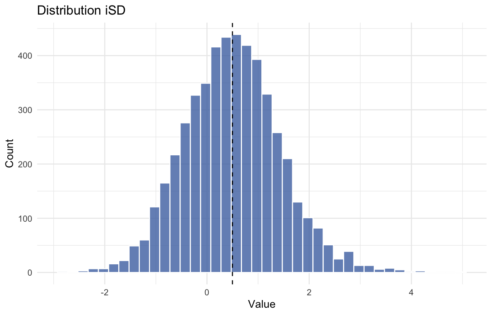{width=672}
:::
:::


---

## Detrended Individual Standard Deviation (residual iSD)

### Description

The detrended iSD removes the linear trend from each subject's time series before
computing the standard deviation. This prevents systematic changes over time
(e.g., learning or fatigue effects) from inflating the variability estimate.

First, a linear trend is fitted for each subject:

$$
\hat{y}_{it} = \beta_{0i} + \beta_{1i} \cdot t
$$

The trend is then subtracted from the observed scores to obtain the residuals:

$$
e_{it} = y_{it} - \hat{y}_{it}
$$

The detrended iSD is then computed as the standard deviation of these residuals:

$$
\text{iSD}_{\text{detrended},i} = \sqrt{\frac{1}{T-1} \sum_{t=1}^{T}(e_{it} - \bar{e}_i)^2}
$$

where $T$ is the number of time points, $e_{it}$ is the residual for subject $i$
at time $t$, and $\bar{e}_i$ is the subject's mean residual (which is zero by
construction of the linear model).


### Estimate detrended iSD


::: {.cell}

```{.r .cell-code  code-fold="false"}
df.LSME <- df.LSME %>%
  group_by(subject) %>%
  mutate(
    trend     = predict(lm(y ~ time)),
    y_detrend = y - trend, # detrend the data
    diSD      = sd(y_detrend, na.rm = TRUE)
  ) %>%
  ungroup()
```
:::


::: {.cell}

```{.r .cell-code  code-fold="false"}
df.LSME %>% head() %>% knitr::kable()
```

::: {.cell-output-display}


| subject| wave| time|         y|     Y_tm1|    Y_tm1d| ctime| mtime|       iSD|     trend|  y_detrend|      diSD|
|-------:|----:|----:|---------:|---------:|---------:|-----:|-----:|---------:|---------:|----------:|---------:|
|       1|    1|    1| 0.5000000| 0.1359326| 0.1359326|  0.01| 0.255| 0.7570122| 0.4167235|  0.0832765| 0.7350656|
|       1|    1|    2| 0.7878708| 0.5000000| 0.5000000|  0.02| 0.255| 0.7570122| 0.4043098|  0.3835609| 0.7350656|
|       1|    1|    3| 0.2842187| 0.7878708| 0.7878708|  0.03| 0.255| 0.7570122| 0.3918962| -0.1076775| 0.7350656|
|       1|    1|    4| 0.5723133| 0.2842187| 0.2842187|  0.04| 0.255| 0.7570122| 0.3794826|  0.1928307| 0.7350656|
|       1|    1|    5| 0.5095047| 0.5723133| 0.5723133|  0.05| 0.255| 0.7570122| 0.3670689|  0.1424357| 0.7350656|
|       1|    1|    6| 1.3511170| 0.5095047| 0.5095047|  0.06| 0.255| 0.7570122| 0.3546553|  0.9964617| 0.7350656|


:::
:::


### Results

::: {.cell}

```{.r .cell-code  code-fold="false"}
# fit trends for all subjects first
trends <- df.LSME %>%
  group_by(subject) %>%
  summarise(slope = coef(lm(y ~ time))[2])

df.LSME <- df.LSME %>%
  left_join(trends, by = "subject")

# pick subjects with most positive, most negative, and flattest slopes
sample_ids <- c(
  trends %>% slice_max(slope, n = 2) %>% pull(subject),
  trends %>% slice_min(slope, n = 2) %>% pull(subject),
  trends %>% slice_min(abs(slope), n = 2) %>% pull(subject)
)
```
:::


#### Step 1: Visualize linear trend fit

::: {.cell}

```{.r .cell-code  code-fold="false"}
# show raw scores + fitted trend for a few subjects
ggplot(df.LSME %>% filter(subject %in% sample_ids), 
       aes(x = time, y = y)) +
  geom_point() +
  geom_smooth(method = "lm", se = FALSE, color = "red") +
  facet_wrap(~subject) +
  labs(title = "Fitted linear trend per subject")
```

::: {.cell-output-display}
{width=672}
:::
:::


#### Step 2: Visualize detrended residuals

::: {.cell}

```{.r .cell-code  code-fold="false"}
# show residuals per subject
ggplot(df.LSME %>% filter(subject %in% sample_ids),
       aes(x = time, y = y_detrend)) +
  geom_point() +
  geom_hline(yintercept = 0, linetype = "dashed", color = "red") +
  facet_wrap(~subject) +
  labs(title = "Step 2: Detrended scores (residuals)")
```

::: {.cell-output-display}
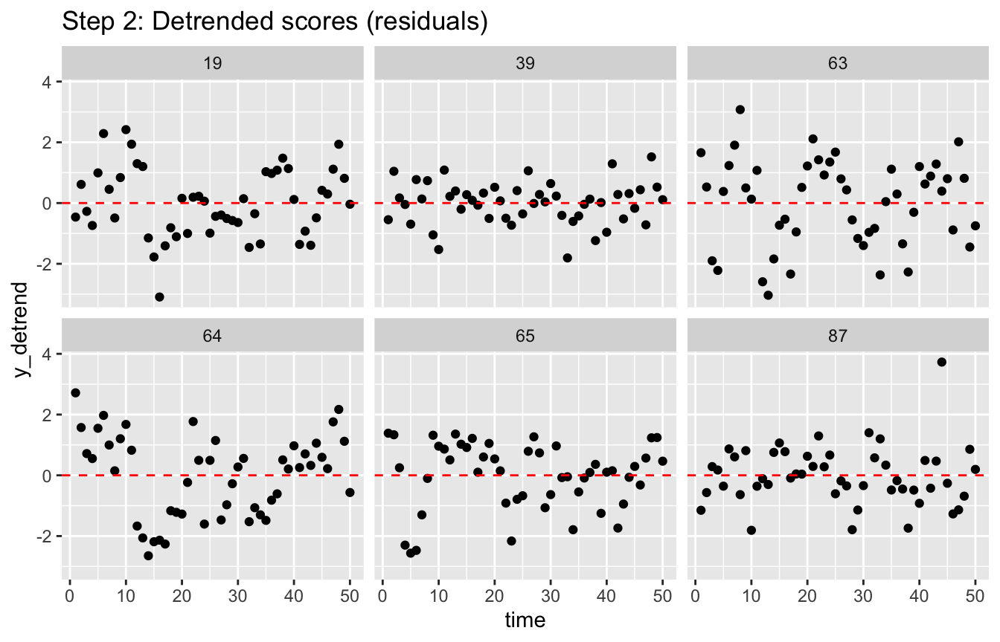{width=672}
:::
:::


#### Step 3: Show detrended iSD values

::: {.cell}

```{.r .cell-code  code-fold="false"}
ggplot(df.LSME, aes(x = diSD)) +
  geom_histogram(bins = 40, fill = "#4C72B0", colour = "white", alpha = .8) +
  geom_vline(xintercept = mean(df.LSME$diSD), linetype = "dashed") +
  labs(title = "Distribution of detrended iSD",
       x = "Detrended iSD", y = "Count") +
  theme_minimal()
```

::: {.cell-output-display}
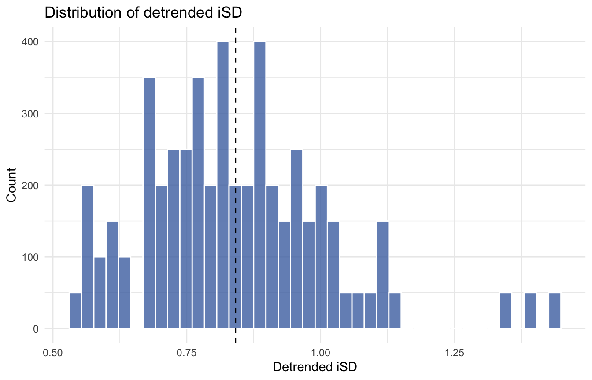{width=672}
:::
:::


---

## Individual Coefficient of Variation (iCV)

### Description

The individual Coefficient of Variation (iCV) reflects each subject's
standard deviation relative to their mean, making it scale-free and
comparable across subjects with different mean levels. In comparison to the relative variability indices by Mestdagh et al., (2018), see below, the iCV is suited for variables with a lower bound (e.g. response times) whereas the relative variability indices are suited for variables with both a lower and upper bond (e.g. VAS questions).

$$
\text{iCV}_i = \frac{\text{iSD}_i}{\bar{y}_i}
$$

where $\text{iSD}_i$ is the standard deviation of subject $i$'s scores and
$\bar{y}_i$ is their personal mean. Unlike the iSD, the iCV is not influenced
by the subject's mean level, which makes it useful when individual differences
in means are expected.

### Estimate iCV


::: {.cell}

```{.r .cell-code  code-fold="false"}
df.LSME <- df.LSME %>%
  group_by(subject) %>%
  mutate(
    iMU = mean(y, na.rm = TRUE),
    iCV = iSD / iMU
  ) %>%
  ungroup()
```
:::


::: {.cell}

```{.r .cell-code  code-fold="false"}
df.LSME %>% head() %>% knitr::kable()
```

::: {.cell-output-display}


| subject| wave| time|         y|     Y_tm1|    Y_tm1d| ctime| mtime|       iSD|     trend|  y_detrend|      diSD|      slope|       iMU|      iCV|
|-------:|----:|----:|---------:|---------:|---------:|-----:|-----:|---------:|---------:|----------:|---------:|----------:|---------:|--------:|
|       1|    1|    1| 0.5000000| 0.1359326| 0.1359326|  0.01| 0.255| 0.7570122| 0.4167235|  0.0832765| 0.7350656| -0.0124136| 0.1125894| 6.723655|
|       1|    1|    2| 0.7878708| 0.5000000| 0.5000000|  0.02| 0.255| 0.7570122| 0.4043098|  0.3835609| 0.7350656| -0.0124136| 0.1125894| 6.723655|
|       1|    1|    3| 0.2842187| 0.7878708| 0.7878708|  0.03| 0.255| 0.7570122| 0.3918962| -0.1076775| 0.7350656| -0.0124136| 0.1125894| 6.723655|
|       1|    1|    4| 0.5723133| 0.2842187| 0.2842187|  0.04| 0.255| 0.7570122| 0.3794826|  0.1928307| 0.7350656| -0.0124136| 0.1125894| 6.723655|
|       1|    1|    5| 0.5095047| 0.5723133| 0.5723133|  0.05| 0.255| 0.7570122| 0.3670689|  0.1424357| 0.7350656| -0.0124136| 0.1125894| 6.723655|
|       1|    1|    6| 1.3511170| 0.5095047| 0.5095047|  0.06| 0.255| 0.7570122| 0.3546553|  0.9964617| 0.7350656| -0.0124136| 0.1125894| 6.723655|


:::
:::


### Results


::: {.cell}

```{.r .cell-code  code-fold="false"}
ggplot(df.LSME, aes(x = iCV)) +
  geom_histogram(bins = 40, fill = "#4C72B0", colour = "white", alpha = .8) +
  geom_vline(xintercept = mean(df.LSME$iCV), linetype = "dashed") +
  labs(title = "Distribution of iCV across subjects",
       x = "iCV", y = "Count") +
  theme_minimal()
```

::: {.cell-output-display}
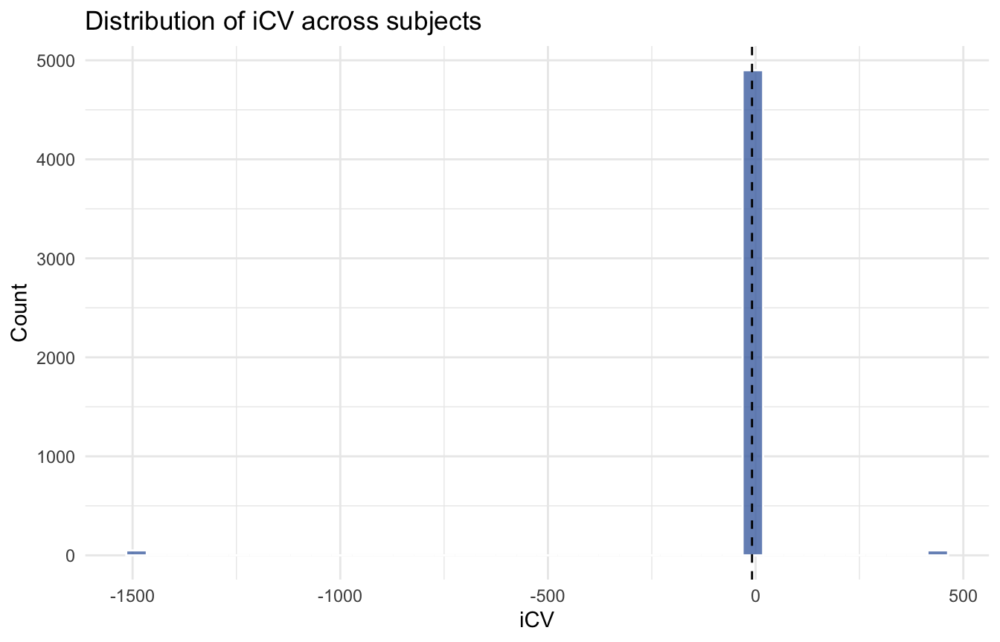{width=672}
:::
:::


::: {.callout-warning}
iCV can only be interpreted when all values are positive and subjects with negative 
means produce negative values. Very small means will produce extreme values and a mean of 0 breaks the iCV estimation. 
When your data has very small means, the difference in the means with very small size will lead to *huge* jumps in iCV. 
Below we present two plots that illustrate this. 
:::

#### iCV example 1: very small mean values with SD = 2.


#### iCV example 2: adding +50 to all means with SD = 2.


---

## Mean Square of Successive Differences (MSSD) 

### Description

The MSSD captures variability by computing the average squared difference
between consecutive observations. Unlike the iSD, it is sensitive to the
**order** of measurements, making it suitable to capture instability over time:

$$
\text{MSSD}_i = \frac{1}{T-1} \sum_{t=2}^{T}(y_{it} - y_{i,t-1})^2
$$

where $T$ is the number of time points and $y_{it} - y_{i,t-1}$ is the
difference between consecutive observations for subject $i$.

### Estimate MSSD


::: {.cell}

```{.r .cell-code  code-fold="false"}
df.LSME <- df.LSME %>%
  group_by(subject) %>%
  mutate(MSSD = psych::mssd(y, na.rm = TRUE)) %>%
  ungroup()
```
:::


::: {.cell}

```{.r .cell-code  code-fold="false"}
df.LSME %>% head() %>% knitr::kable()
```

::: {.cell-output-display}


| subject| wave| time|         y|     Y_tm1|    Y_tm1d| ctime| mtime|       iSD|     trend|  y_detrend|      diSD|      slope|       iMU|      iCV|      MSSD|
|-------:|----:|----:|---------:|---------:|---------:|-----:|-----:|---------:|---------:|----------:|---------:|----------:|---------:|--------:|---------:|
|       1|    1|    1| 0.5000000| 0.1359326| 0.1359326|  0.01| 0.255| 0.7570122| 0.4167235|  0.0832765| 0.7350656| -0.0124136| 0.1125894| 6.723655| 0.4873861|
|       1|    1|    2| 0.7878708| 0.5000000| 0.5000000|  0.02| 0.255| 0.7570122| 0.4043098|  0.3835609| 0.7350656| -0.0124136| 0.1125894| 6.723655| 0.4873861|
|       1|    1|    3| 0.2842187| 0.7878708| 0.7878708|  0.03| 0.255| 0.7570122| 0.3918962| -0.1076775| 0.7350656| -0.0124136| 0.1125894| 6.723655| 0.4873861|
|       1|    1|    4| 0.5723133| 0.2842187| 0.2842187|  0.04| 0.255| 0.7570122| 0.3794826|  0.1928307| 0.7350656| -0.0124136| 0.1125894| 6.723655| 0.4873861|
|       1|    1|    5| 0.5095047| 0.5723133| 0.5723133|  0.05| 0.255| 0.7570122| 0.3670689|  0.1424357| 0.7350656| -0.0124136| 0.1125894| 6.723655| 0.4873861|
|       1|    1|    6| 1.3511170| 0.5095047| 0.5095047|  0.06| 0.255| 0.7570122| 0.3546553|  0.9964617| 0.7350656| -0.0124136| 0.1125894| 6.723655| 0.4873861|


:::
:::


### Results


::: {.cell}

```{.r .cell-code  code-fold="false"}
ggplot(df.LSME %>% distinct(subject, MSSD), aes(x = MSSD)) +
  geom_histogram(bins = 40, fill = "#4C72B0", colour = "white", alpha = .8) +
  geom_vline(xintercept = mean(df.LSME$MSSD), linetype = "dashed") +
  labs(title = "Distribution of MSSD across subjects",
       x = "MSSD", y = "Count") +
  theme_minimal()
```

::: {.cell-output-display}
{width=672}
:::
:::


## Detrended Mean Square of Successive Differences (Detrended MSSD) 

### Description

The detrended MSSD first removes the linear trend from each subject's time
series before computing the average squared difference between consecutive
observations. This prevents systematic changes over time from inflating the
variability estimate:

$$
\text{MSSD}_{\text{detrended},i} = \frac{1}{T-1} \sum_{t=2}^{T}(e_{it} - e_{i,t-1})^2
$$

where $T$ is the number of time points and $e_{it} = y_{it} - \hat{y}_{it}$
is the residual after removing the linear trend for subject $i$.

### Estimate detrended MSSD


::: {.cell}

```{.r .cell-code  code-fold="false"}
df.LSME <- df.LSME %>%
  group_by(subject) %>%
  mutate(MSSD_detrend = psych::mssd(y_detrend, na.rm = TRUE)) %>%
  ungroup()
```
:::


::: {.cell}

```{.r .cell-code  code-fold="false"}
df.LSME %>% head() %>% knitr::kable()
```

::: {.cell-output-display}


| subject| wave| time|         y|     Y_tm1|    Y_tm1d| ctime| mtime|       iSD|     trend|  y_detrend|      diSD|      slope|       iMU|      iCV|      MSSD| MSSD_detrend|
|-------:|----:|----:|---------:|---------:|---------:|-----:|-----:|---------:|---------:|----------:|---------:|----------:|---------:|--------:|---------:|------------:|
|       1|    1|    1| 0.5000000| 0.1359326| 0.1359326|  0.01| 0.255| 0.7570122| 0.4167235|  0.0832765| 0.7350656| -0.0124136| 0.1125894| 6.723655| 0.4873861|    0.4867643|
|       1|    1|    2| 0.7878708| 0.5000000| 0.5000000|  0.02| 0.255| 0.7570122| 0.4043098|  0.3835609| 0.7350656| -0.0124136| 0.1125894| 6.723655| 0.4873861|    0.4867643|
|       1|    1|    3| 0.2842187| 0.7878708| 0.7878708|  0.03| 0.255| 0.7570122| 0.3918962| -0.1076775| 0.7350656| -0.0124136| 0.1125894| 6.723655| 0.4873861|    0.4867643|
|       1|    1|    4| 0.5723133| 0.2842187| 0.2842187|  0.04| 0.255| 0.7570122| 0.3794826|  0.1928307| 0.7350656| -0.0124136| 0.1125894| 6.723655| 0.4873861|    0.4867643|
|       1|    1|    5| 0.5095047| 0.5723133| 0.5723133|  0.05| 0.255| 0.7570122| 0.3670689|  0.1424357| 0.7350656| -0.0124136| 0.1125894| 6.723655| 0.4873861|    0.4867643|
|       1|    1|    6| 1.3511170| 0.5095047| 0.5095047|  0.06| 0.255| 0.7570122| 0.3546553|  0.9964617| 0.7350656| -0.0124136| 0.1125894| 6.723655| 0.4873861|    0.4867643|


:::
:::


### Results

#### Step 1: Visualize linear trend fit

::: {.cell}

```{.r .cell-code  code-fold="false"}
#### Visualize linear trend fit
ggplot(df.LSME %>% filter(subject %in% sample_ids), 
       aes(x = time, y = y)) +
  geom_point() +
  geom_smooth(method = "lm", se = FALSE, color = "red") +
  facet_wrap(~subject) +
  labs(title = "Fitted linear trend per subject")
```

::: {.cell-output-display}
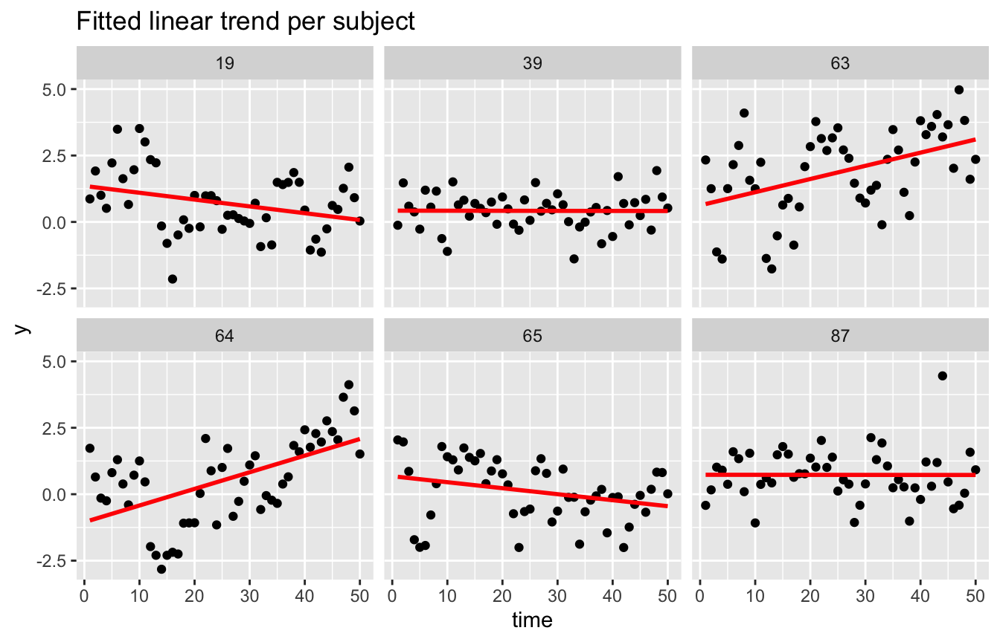{width=672}
:::
:::


#### Step 2: Visualize consecutive differences of detrended residuals

::: {.cell}

```{.r .cell-code  code-fold="false"}
ggplot(df.LSME %>% filter(subject %in% sample_ids),
       aes(x = time, y = y_detrend)) +
  geom_point() +
  geom_line(alpha = 0.4) +
  geom_hline(yintercept = 0, linetype = "dashed", color = "red") +
  facet_wrap(~subject) +
  labs(title = "Step 2: Detrended residuals (adding lines to emphasize consecutive differences)",
       y = "Detrended residual")
```

::: {.cell-output-display}
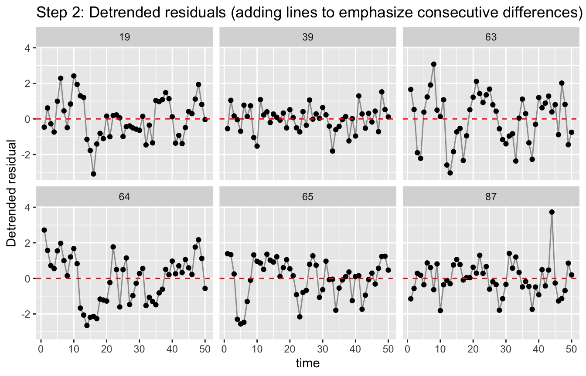{width=672}
:::
:::


#### Step 3: Show detrended MSSD values

::: {.cell}

```{.r .cell-code  code-fold="false"}
ggplot(df.LSME %>% distinct(subject, MSSD_detrend), aes(x = MSSD_detrend)) +
  geom_histogram(bins = 40, fill = "#4C72B0", colour = "white", alpha = .8) +
  geom_vline(xintercept = mean(df.LSME %>% distinct(subject, MSSD_detrend) %>% pull(MSSD_detrend)),
           linetype = "dashed") +
  labs(title = "Distribution of detrended MSSD across subjects",
       x = "Detrended MSSD", y = "Count") +
  theme_minimal()
```

::: {.cell-output-display}
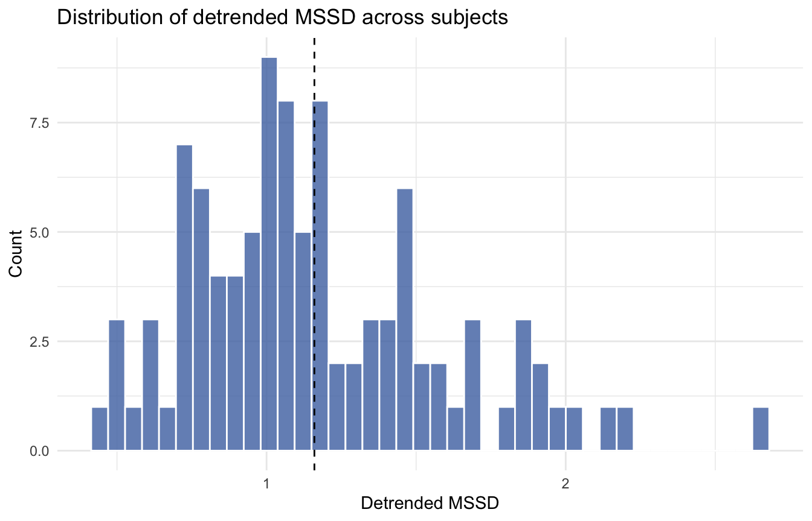{width=672}
:::
:::


## Root Mean Square of Successive Differences (rMSSD)

### Description

The rMSSD computes the square root of the average squared difference between
consecutive observations. Unlike the MSSD and the detrended MSSD, it operates on the raw
time series without removing the linear trend first. Taking the square root
brings the estimate back to the original scale of the data which aids with interpretation.

$$
\text{rMSSD}_i = \sqrt{\frac{1}{T-1} \sum_{t=2}^{T}(y_{it} - y_{i,t-1})^2}
$$

where $T$ is the number of time points and $y_{it} - y_{i,t-1}$ is the
difference between consecutive observations for subject $i$.


### Estimate root MSSD


::: {.cell}

```{.r .cell-code  code-fold="false"}
df.LSME <- df.LSME %>%
  group_by(subject) %>%
  mutate(rMSSD = psych::rmssd(y, na.rm = TRUE)) %>%
  ungroup()
```
:::


::: {.cell}

```{.r .cell-code  code-fold="false"}
df.LSME %>% head() %>% knitr::kable()
```

::: {.cell-output-display}


| subject| wave| time|         y|     Y_tm1|    Y_tm1d| ctime| mtime|       iSD|     trend|  y_detrend|      diSD|      slope|       iMU|      iCV|      MSSD| MSSD_detrend|     rMSSD|
|-------:|----:|----:|---------:|---------:|---------:|-----:|-----:|---------:|---------:|----------:|---------:|----------:|---------:|--------:|---------:|------------:|---------:|
|       1|    1|    1| 0.5000000| 0.1359326| 0.1359326|  0.01| 0.255| 0.7570122| 0.4167235|  0.0832765| 0.7350656| -0.0124136| 0.1125894| 6.723655| 0.4873861|    0.4867643| 0.6981304|
|       1|    1|    2| 0.7878708| 0.5000000| 0.5000000|  0.02| 0.255| 0.7570122| 0.4043098|  0.3835609| 0.7350656| -0.0124136| 0.1125894| 6.723655| 0.4873861|    0.4867643| 0.6981304|
|       1|    1|    3| 0.2842187| 0.7878708| 0.7878708|  0.03| 0.255| 0.7570122| 0.3918962| -0.1076775| 0.7350656| -0.0124136| 0.1125894| 6.723655| 0.4873861|    0.4867643| 0.6981304|
|       1|    1|    4| 0.5723133| 0.2842187| 0.2842187|  0.04| 0.255| 0.7570122| 0.3794826|  0.1928307| 0.7350656| -0.0124136| 0.1125894| 6.723655| 0.4873861|    0.4867643| 0.6981304|
|       1|    1|    5| 0.5095047| 0.5723133| 0.5723133|  0.05| 0.255| 0.7570122| 0.3670689|  0.1424357| 0.7350656| -0.0124136| 0.1125894| 6.723655| 0.4873861|    0.4867643| 0.6981304|
|       1|    1|    6| 1.3511170| 0.5095047| 0.5095047|  0.06| 0.255| 0.7570122| 0.3546553|  0.9964617| 0.7350656| -0.0124136| 0.1125894| 6.723655| 0.4873861|    0.4867643| 0.6981304|


:::
:::


### Results


::: {.cell}

```{.r .cell-code  code-fold="false"}
ggplot(df.LSME %>% distinct(subject, rMSSD), aes(x = rMSSD)) +
  geom_histogram(bins = 40, fill = "#4C72B0", colour = "white", alpha = .8) +
  geom_vline(xintercept = mean(df.LSME$rMSSD), linetype = "dashed") +
  labs(title = "Distribution of rMSSD across subjects",
       x = "rMSSD", y = "Count") +
  theme_minimal()
```

::: {.cell-output-display}
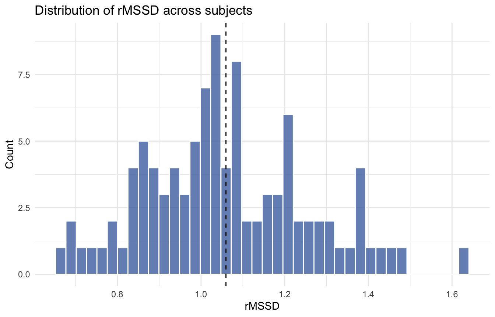{width=672}
:::
:::


## Ex-Gaussian Tau

### Description

The ex-Gaussian distribution is a combination of a normal and an exponential
distribution, frequently used to model response time distributions. Here we have 3
parameters: $\mu$ and $\sigma$ describing the normal component, and $\tau$
describing the exponential tail. The $\tau$ parameter captures the degree of
right-skew in the distribution and is interpreted as a measure of
intra-individual variability:

$$
\tau_i = \frac{1}{\lambda_i}
$$

where $\lambda_i$ is the rate parameter of the exponential component for
subject $i$. Larger $\tau$ values indicate a longer, heavier tail —
reflecting more extreme slow responses.

::: {.callout-note}
The ex-Gaussian distribution needs positive values. The simulated
data is shifted by adding a constant of 20 to ensure all values are positive
before fitting.
:::


### Estimate ex-Gaussian tau


::: {.cell}

```{.r .cell-code  code-fold="false"}
# Shift y so it is positive
df.LSME <- df.LSME %>% mutate(y_shifted = y + 20)

# Estimate ex-Gaussian parameters per subject
subject_exGauss <- data.frame(subject = character(),
                              mu    = numeric(),
                              sigma = numeric(),
                              tau   = numeric(),
                              stringsAsFactors = FALSE)

# Use only first 20 subjects
sub_id <- unique(df.LSME$subject)[1:20]

for (subj in sub_id) {
  tryCatch({
    subject_data <- df.LSME %>% filter(subject == subj)
    fit <- BayesianExgaussian(n = 50, x = subject_data$y_shifted,
                          nSamples = 500, Ti = 250)
    subject_exGauss <- rbind(subject_exGauss,
                             data.frame(subject = subj,
                                        mu    = fit$mu,
                                        sigma = fit$sigma,
                                        tau   = fit$tau))
  }, error = function(e) {
    message("Skipping subject ", subj, ": ", e$message)
  })
}

# join tau back into df.LSME
df.LSME <- df.LSME %>%
  left_join(subject_exGauss %>% select(subject, tau), by = "subject")
```
:::


::: {.cell}

```{.r .cell-code  code-fold="false"}
df.LSME %>% head() %>% knitr::kable()
```

::: {.cell-output-display}


| subject| wave| time|         y|     Y_tm1|    Y_tm1d| ctime| mtime|       iSD|     trend|  y_detrend|      diSD|      slope|       iMU|      iCV|      MSSD| MSSD_detrend|     rMSSD| y_shifted|       tau|
|-------:|----:|----:|---------:|---------:|---------:|-----:|-----:|---------:|---------:|----------:|---------:|----------:|---------:|--------:|---------:|------------:|---------:|---------:|---------:|
|       1|    1|    1| 0.5000000| 0.1359326| 0.1359326|  0.01| 0.255| 0.7570122| 0.4167235|  0.0832765| 0.7350656| -0.0124136| 0.1125894| 6.723655| 0.4873861|    0.4867643| 0.6981304|  20.50000| 0.2917764|
|       1|    1|    2| 0.7878708| 0.5000000| 0.5000000|  0.02| 0.255| 0.7570122| 0.4043098|  0.3835609| 0.7350656| -0.0124136| 0.1125894| 6.723655| 0.4873861|    0.4867643| 0.6981304|  20.78787| 0.2917764|
|       1|    1|    3| 0.2842187| 0.7878708| 0.7878708|  0.03| 0.255| 0.7570122| 0.3918962| -0.1076775| 0.7350656| -0.0124136| 0.1125894| 6.723655| 0.4873861|    0.4867643| 0.6981304|  20.28422| 0.2917764|
|       1|    1|    4| 0.5723133| 0.2842187| 0.2842187|  0.04| 0.255| 0.7570122| 0.3794826|  0.1928307| 0.7350656| -0.0124136| 0.1125894| 6.723655| 0.4873861|    0.4867643| 0.6981304|  20.57231| 0.2917764|
|       1|    1|    5| 0.5095047| 0.5723133| 0.5723133|  0.05| 0.255| 0.7570122| 0.3670689|  0.1424357| 0.7350656| -0.0124136| 0.1125894| 6.723655| 0.4873861|    0.4867643| 0.6981304|  20.50950| 0.2917764|
|       1|    1|    6| 1.3511170| 0.5095047| 0.5095047|  0.06| 0.255| 0.7570122| 0.3546553|  0.9964617| 0.7350656| -0.0124136| 0.1125894| 6.723655| 0.4873861|    0.4867643| 0.6981304|  21.35112| 0.2917764|


:::
:::


### Results


::: {.cell}

```{.r .cell-code  code-fold="false"}
ggplot(subject_exGauss, aes(x = tau)) +
  geom_histogram(bins = 40, fill = "#4C72B0", colour = "white", alpha = .8) +
  geom_vline(xintercept = mean(subject_exGauss$tau), linetype = "dashed") +
  labs(title = "Distribution of ex-Gaussian tau across subjects",
       x = "Tau", y = "Count") +
  theme_minimal()
```

::: {.cell-output-display}
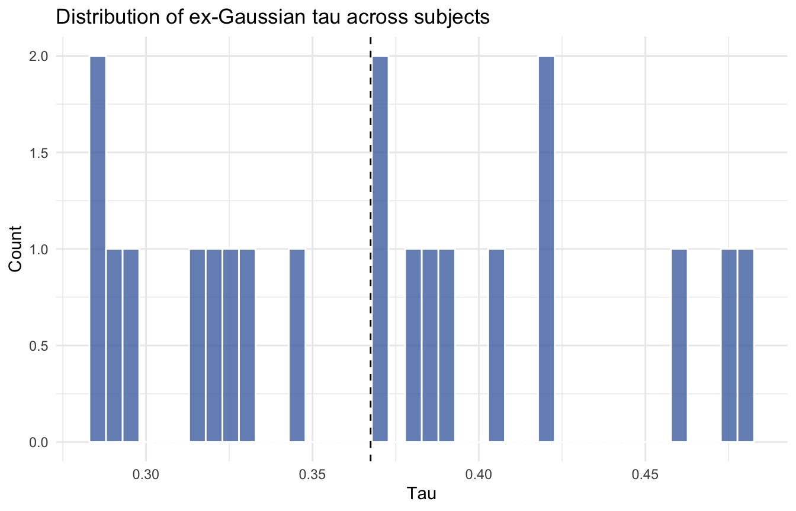{width=672}
:::
:::


## residual Standard Deviation (SD) from Linear Regression Model (lme4)

### Description

A linear model is fitted for each individual subject independently, regressing the outcome
$y$ on the intercept, a trend (time), and the autoregressive term $y_{t-1}$.
The residual standard deviation $\hat{\sigma}_i$ is extracted as the measure
of variability — capturing the spread of observations around a subject's predicted outcome.

$$
y_{it} = \beta_{0i} + \beta_{1i} \cdot \text{time}_{it} + \beta_{2i} \cdot y_{i,t-1} + \varepsilon_{it}, \quad \varepsilon_{it} \sim \mathcal{N}(0, \sigma_i^2)
$$

where $\sigma_i$ is the residual standard deviation for subject $i$.

### Estimate residual SD from a Linear Model


::: {.cell}

```{.r .cell-code}
sub_id <- unique(df.LSME$subject)

# Fit lm for each subject
twolevel <- list()
for (subj in sub_id) {
  subject_data     <- df.LSME %>% filter(subject == subj)
  twolevel[[subj]] <- lm(y ~ 1 + ctime + Y_tm1, data = subject_data)
}

# Extract effects
effects_list <- list()
for (subj in sub_id) {
  effects_list[[subj]] <- as.data.frame(tidy(twolevel[[subj]]))
}

# Store estimates per subject
intercept <- data.frame()
trend     <- data.frame()
ar1       <- data.frame()
trialsd   <- data.frame()

for (subj in sub_id) {
  intercept[subj, 1] <- effects_list[[subj]]$estimate[1]
  trend[subj, 1]     <- effects_list[[subj]]$estimate[2]
  ar1[subj, 1]       <- effects_list[[subj]]$estimate[3]
  trialsd[subj, 1]   <- summary(twolevel[[subj]])$sigma
}

# Add residual SD to df.LSME
df.LSME <- df.LSME %>%
  left_join(
    data.frame(subject = sub_id, lm_sigma = unlist(trialsd)),
    by = "subject"
  )
```
:::


::: {.cell}

```{.r .cell-code  code-fold="false"}
df.LSME %>% head() %>% knitr::kable()
```

::: {.cell-output-display}


| subject| wave| time|         y|     Y_tm1|    Y_tm1d| ctime| mtime|       iSD|     trend|  y_detrend|      diSD|      slope|       iMU|      iCV|      MSSD| MSSD_detrend|     rMSSD| y_shifted|       tau|  lm_sigma|
|-------:|----:|----:|---------:|---------:|---------:|-----:|-----:|---------:|---------:|----------:|---------:|----------:|---------:|--------:|---------:|------------:|---------:|---------:|---------:|---------:|
|       1|    1|    1| 0.5000000| 0.1359326| 0.1359326|  0.01| 0.255| 0.7570122| 0.4167235|  0.0832765| 0.7350656| -0.0124136| 0.1125894| 6.723655| 0.4873861|    0.4867643| 0.6981304|  20.50000| 0.2917764| 0.6305225|
|       1|    1|    2| 0.7878708| 0.5000000| 0.5000000|  0.02| 0.255| 0.7570122| 0.4043098|  0.3835609| 0.7350656| -0.0124136| 0.1125894| 6.723655| 0.4873861|    0.4867643| 0.6981304|  20.78787| 0.2917764| 0.6305225|
|       1|    1|    3| 0.2842187| 0.7878708| 0.7878708|  0.03| 0.255| 0.7570122| 0.3918962| -0.1076775| 0.7350656| -0.0124136| 0.1125894| 6.723655| 0.4873861|    0.4867643| 0.6981304|  20.28422| 0.2917764| 0.6305225|
|       1|    1|    4| 0.5723133| 0.2842187| 0.2842187|  0.04| 0.255| 0.7570122| 0.3794826|  0.1928307| 0.7350656| -0.0124136| 0.1125894| 6.723655| 0.4873861|    0.4867643| 0.6981304|  20.57231| 0.2917764| 0.6305225|
|       1|    1|    5| 0.5095047| 0.5723133| 0.5723133|  0.05| 0.255| 0.7570122| 0.3670689|  0.1424357| 0.7350656| -0.0124136| 0.1125894| 6.723655| 0.4873861|    0.4867643| 0.6981304|  20.50950| 0.2917764| 0.6305225|
|       1|    1|    6| 1.3511170| 0.5095047| 0.5095047|  0.06| 0.255| 0.7570122| 0.3546553|  0.9964617| 0.7350656| -0.0124136| 0.1125894| 6.723655| 0.4873861|    0.4867643| 0.6981304|  21.35112| 0.2917764| 0.6305225|


:::
:::


### Results


::: {.cell}

```{.r .cell-code  code-fold="false"}
ggplot(df.LSME %>% distinct(subject, lm_sigma), aes(x = lm_sigma)) +
  geom_histogram(bins = 40, fill = "#4C72B0", colour = "white", alpha = .8) +
  geom_vline(xintercept = mean(df.LSME$lm_sigma, na.rm = TRUE), linetype = "dashed") +
  labs(title = "Distribution of residual SD across subjects",
       x = "Residual SD", y = "Count") +
  theme_minimal()
```

::: {.cell-output-display}
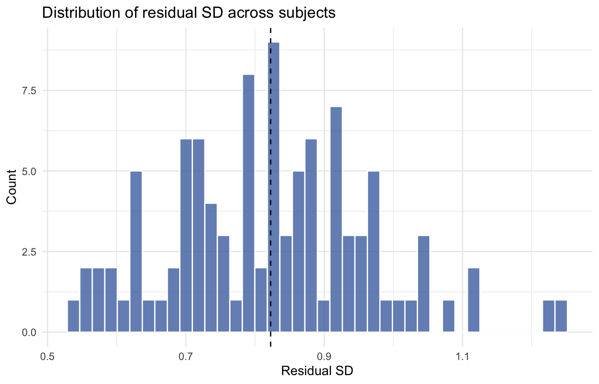{width=672}
:::
:::


## Dynamic Structural Equation Modeling (DSEM)

::: {.callout-tip}
Researchers from the [Lifespan Cognitive Dynamics Lab](https://lifespancognitivedynamics.com/) have developed openly available resources for DSEM such as a DSEM tutorial in R where the focus is less on variability, but more on the general framework and recent extensions such as modeling asymmetry in the autoregresive structure. The DSEM tutorial can be consulted [here](https://jessicaschaaf.github.io/jessicaschaaf/dsem-workshop.html) and the DSEM paper about DYNamics of ASymmetric TIme series (DYNASTI) can be found [here](https://doi.org/10.1080/10705511.2025.2519208).
:::


### Description

DSEM estimates within-subject variability as the standard deviation of the innovations — the residual spread around each subject's predicted trajectory. Here we fit a 4-parameter DSEM after accounting for the mean, linear systematic change, and the autoregressive structure where next to population-level fixed effects, random effects (individual differences in the subject-specific parameters) are estimated.


$$
y_{it} \sim \mathcal{N}\left(\alpha_i + \beta_i(t - \bar{t}_i) + \phi_i(y_{i,t-1} - \alpha_i),\ \exp(\sigma + u_{4i})\right)
$$

where $\alpha_i$ is the subject mean, $\beta_i$ is the systematich change over time and $\phi_i$ is the
autoregressive parameter. Crucially, $\exp(\sigma + u_{4i})$ describes the the population level variability $\sigma$ and the individual differences / random effects $u_{4i}$ , which is the key parameter of interest for cognitive variability and quantifies how much subjects differ from each other in their variability over and above systematic change and autocorrelation.


::: {.callout-note}
In this tutorial, we fit a DSEM in Stan via `cmdstanr`. Sampling 4 chains with 1000
iterations each is computationally intensive — expect a potential waiting time of a few minutes
depending on the computational resources available. 
:::


### Estimating a DSEM

Stan, the language we specify our DSEM in, requires data to be formatted in a list. Stan needs to identify the correct data sources, so we have to create variables in a list and assign data to each variable.

Here we briefly explain each variable within the list.

- **`N_subj`**: Number of unique subjects; determines the size of subject-level random effect vectors.
- **`Y`**: Vector of the time series data (outcome variable being modelled).
- **`N_obs`**: Total number of unique trials within a day/wave. *Not used in this model.*
- **`N_days`**: Number of days. *Not used in this model.*
- **`N`**: Total number of observations (rows); used as the main loop bound throughout the model.
- **`subj`**: Integer index identifying which subject each row belongs to; used to look up that subject's random effects `u[subj, ...]`.
- **`day`**: Integer index identifying which wave/day each row belongs to. *Not used in this model.*
- **`Y_tm1`**: Lagged outcome (Y at the previous observation within the same day/wave); drives the autoregressive part: `(Y_tm1 - person_mean) * (phi + u[subj,3])`.
- **`Y_tm1d`**: Lagged outcome from the previous day (cross-day lag). *Not used in this model.*
- **`time`**: Within-day centred time of each observation; used in the linear time trend: `(time - mtime[subj]) * (beta + u[subj,2])`.
- **`mtime`**: Each subject's mean time across observations (length = `N_subj`); centres the trend so the intercept reflects the person's mean level rather than time = 0.

#### Create list for DSEM


::: {.cell}

```{.r .cell-code  code-fold="false"}
# Create vector with centering variable for the mean
l2time <- df.LSME %>%
  group_by(subject) %>%
  summarise(mtime = mean(ctime, na.rm = TRUE)) %>%
  pull(mtime)

# Create list for DSEM
dsem_list <- list(
  N_subj  = length(unique(as.numeric(as.factor(df.LSME$subject)))),
  Y       = df.LSME$y,
  N_obs   = length(unique(df.LSME$time)),
  N_days  = length(unique(as.numeric(as.factor(df.LSME$wave)))),
  subj    = as.numeric(as.factor(df.LSME$subject)),
  day     = as.numeric(as.factor(df.LSME$wave)),
  N       = nrow(df.LSME),
  mtime   = l2time,
  time    = df.LSME$ctime,
  Y_tm1   = df.LSME$Y_tm1,
  Y_tm1d  = df.LSME$Y_tm1d
)

# Inspect list
str(dsem_list)
```

::: {.cell-output .cell-output-stdout}

```
List of 11
 $ N_subj: int 100
 $ Y     : num [1:5000] 0.5 0.788 0.284 0.572 0.51 ...
 $ N_obs : int 50
 $ N_days: int 1
 $ subj  : num [1:5000] 1 1 1 1 1 1 1 1 1 1 ...
 $ day   : num [1:5000] 1 1 1 1 1 1 1 1 1 1 ...
 $ N     : int 5000
 $ mtime : num [1:100] 0.255 0.255 0.255 0.255 0.255 0.255 0.255 0.255 0.255 0.255 ...
 $ time  : num [1:5000] 0.01 0.02 0.03 0.04 0.05 0.06 0.07 0.08 0.09 0.1 ...
 $ Y_tm1 : num [1:5000] 0.136 0.5 0.788 0.284 0.572 ...
 $ Y_tm1d: num [1:5000] 0.136 0.5 0.788 0.284 0.572 ...
```


:::
:::


#### Compile DSEM model


::: {.callout-note}
The DSEM model code below is written in [Stan](https://mc-stan.org/) and 'vectorized' to optimize Bayesian sampling. You can learn more about 'Vectorization' [here](https://mc-stan.org/docs/2_18/stan-users-guide/vectorization.html) 
:::


::: {.cell}

```{.r .cell-code  code-fold="false"}
dsem_standard <- "
data {
  int<lower = 1> N; 
  int<lower = 1> N_subj; 
  array[N] int<lower=1, upper=N_subj> subj;
  vector[N] Y;
  vector[N] time;
  vector[N] Y_tm1;
  vector[N_subj] mtime;
}
parameters {
  real sigma;
  vector<lower=0>[4] tau_u;
  real alpha;
  real beta;
  real phi;
  matrix[4, N_subj] z_u;
  cholesky_factor_corr[4] L_u;
}
transformed parameters {
  matrix[N_subj,4] u;
  u = transpose(diag_pre_multiply(tau_u, L_u) * z_u);
}

model {
  alpha ~ normal(0, 50);
  phi   ~ normal(0, 50);
  beta  ~ normal(0, 50);
  sigma ~ normal(0, 50);
  tau_u ~ cauchy(0, 2);

  to_vector(z_u) ~ std_normal();
  L_u ~ lkj_corr_cholesky(1);

  Y ~ normal(alpha + u[subj,1] + (time - mtime[subj]).*(beta+u[subj,2]) + 
             (Y_tm1 - (alpha + u[subj,1])).*(phi+u[subj,3]),
             exp(sigma + u[subj,4]));
}
generated quantities {
  corr_matrix[4] rho_u = L_u * L_u';
  vector[N] log_lik;

  for (i in 1:N) {
    log_lik[i] = normal_lpdf(Y[i] | alpha + u[subj[i],1] +
      (time[i] - mtime[subj[i]]).*(beta+u[subj[i],2]) +
      (Y_tm1[i] - (alpha + u[subj[i],1])).*(phi+u[subj[i],3]),
      exp(sigma + u[subj[i],4]));
  }
  real sum_ll = sum(log_lik);
}
"

writeLines(dsem_standard, "dsem_standard.stan")

# Compile directly from string
model2 <- cmdstan_model(
  "dsem_standard.stan",
  stanc_options = list("O1")
)
```
:::


#### Fit DSEM

::: {.cell}

```{.r .cell-code  code-fold="false"}
# Verify data before fitting
stopifnot(
  is.list(dsem_list),
  exists("model2")
)

fit2 <- model2$sample(
  dsem_list,
  chains = 4,
  parallel_chains = 2,
  iter_warmup = 500,
  iter_sampling = 1000,
  save_warmup = FALSE,
  refresh         = 100
)

fit2$save_object("fit2.rds") 
```
:::


::: {.callout-note}
The model was fit using 4 chains with 500 warmup and 1000 sampling 
iterations each, run on 2 parallel chains, resulting in 4000 
post-warmup draws total.
:::

#### Reload

::: {.cell}

```{.r .cell-code  code-fold="false"}
fit2 <- readRDS("fit2.rds")
```
:::


::: {.cell}

```{.r .cell-code  code-fold="false"}
# Extract draws of parameters for table
draws <- fit2$draws(format = "df", c("alpha", "beta", "phi", "sigma",
                                      "tau_u[1]", "tau_u[2]", "tau_u[3]",
                                      "tau_u[4]")) 

sum2 <- posterior::summarise_draws(
  draws,
  "mean",
  "median",
  "sd",
  "mad",
  ~quantile(.x, probs = c(0.025, 0.975)),
  "rhat",
  "ess_bulk",
  "ess_tail"
)

print2<-print(sum2) # print parameters
```

::: {.cell-output .cell-output-stdout}

```
# A tibble: 8 × 10
  variable   mean median     sd    mad   `2.5%` `97.5%`  rhat ess_bulk ess_tail
  <chr>     <dbl>  <dbl>  <dbl>  <dbl>    <dbl>   <dbl> <dbl>    <dbl>    <dbl>
1 alpha     0.496  0.496 0.0324 0.0320  0.434     0.562  1.00     949.    1687.
2 beta      0.127  0.126 0.0850 0.0834 -0.0345    0.295  1.00    4872.    3377.
3 phi       0.221  0.221 0.0248 0.0244  0.172     0.270  1.00    1892.    3125.
4 sigma    -0.197 -0.197 0.0183 0.0182 -0.233    -0.161  1.00    1645.    2457.
5 tau_u[1]  0.262  0.260 0.0271 0.0258  0.213     0.319  1.00    1296.    1743.
6 tau_u[2]  0.237  0.208 0.172  0.191   0.00983   0.612  1.02     409.    1345.
7 tau_u[3]  0.199  0.198 0.0210 0.0210  0.159     0.242  1.00    1723.    2647.
8 tau_u[4]  0.151  0.150 0.0165 0.0164  0.120     0.185  1.00    1932.    2814.
```


:::
:::


### Results

From this output there is many information to inspect. We'll briefly go over it.

- **`alpha`**: population mean
- **`beta`**: population trend
- **`phi`**: population autoregression
- **`sigma`**: population log residual SD 

Standard deviations of random effects:

- **`tau_u`**: a vector of 4 SDs, one for each random effect.

Key information about each resulting parameter estimate:

- **`mean`**:  mean of the posterior distribution of each parameter. Frequently reported as ‘the best point estimate of the parameter.
- **`median`**: the 50% posterior quantile.
- **`sd`**: the posterior standard deviation. Reflects the uncertainty in the parameter estimate where larger values indicate greater uncertainty.
- **`mad`**: the median absolute deviation, a measure of posterior spread.
- **`q2.5`** and **`q97.5`**: the 2.5% and 97.5% posterior quantiles. These define the 95% credible interval for the parameter. This basically means that there is a 95% probability that the parameter lies in this interval. 
- **`rhat`**: the potential scale reduction factor [Gelman & Rubin, 1992](https://projecteuclid.org/journals/statistical-science/volume-7/issue-4/Inference-from-Iterative-Simulation-Using-Multiple-Sequences/10.1214/ss/1177011136.pdf) with which you can identify model convergence across MCMC chains. Values above 1.1 are generally considered problematic and the closer to 1 the better.
- **`ess_bulk`**. A metric indicating the sampling efficiency in the bulk of the posterior. It is defined as the effective sample size for rank normalized values using split chains. Higher values indicate more reliable estimation.
- **`ess_tail`**: A metric indicating the sampling efficiency in the tails of the posterior. It is defined as the minimum of the effective sample sizes for 5% and 95% quantiles. Low values could suggest poor exploration of the posterior tails. 


#### Additional diagnostic checks for model convergence

::: {.cell}

```{.r .cell-code  code-fold="false"}
mcmc_trace(draws, c("alpha", "beta", "phi", "sigma",
                               "tau_u[1]", "tau_u[2]", "tau_u[3]",
                               "tau_u[4]"))
```

::: {.cell-output-display}
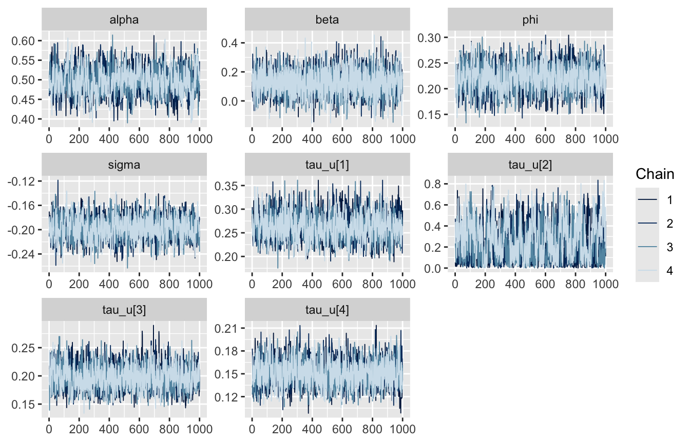{width=672}
:::

```{.r .cell-code  code-fold="false"}
mcmc_hist(draws, c("alpha", "beta", "phi", "sigma",
                             "tau_u[1]", "tau_u[2]", "tau_u[3]",
                             "tau_u[4]"))
```

::: {.cell-output-display}
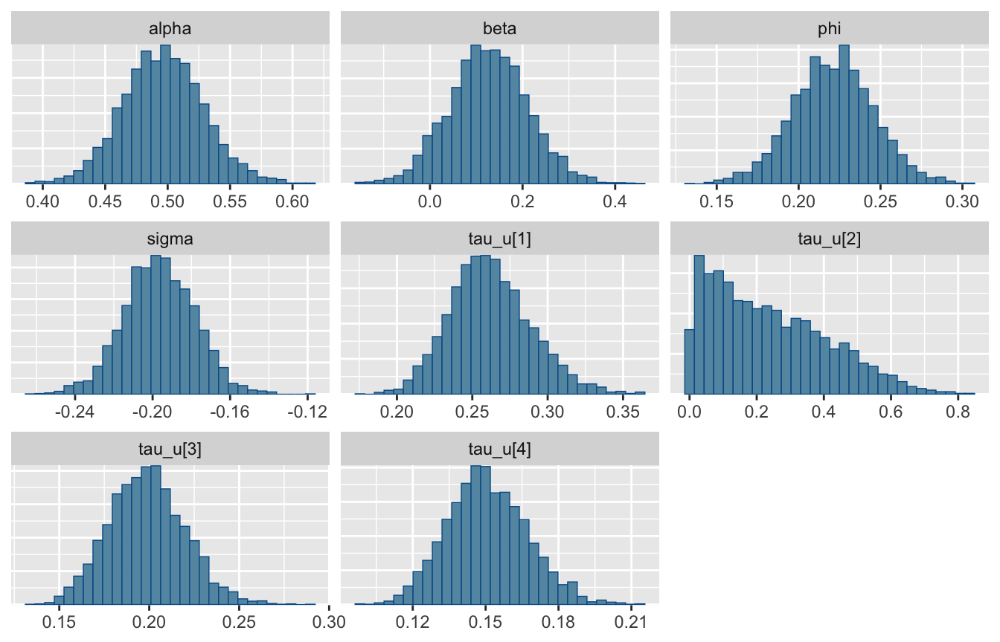{width=672}
:::
:::


From `mcmc_trace` we see that each chain is mixing well (also more informally known as the 'hairy caterpillar plot') and from `mcmc_hist` we see histograms of the posterior draws for each parameter with all chains merged.


#### Plot variability estimates


::: {.cell}

```{.r .cell-code  code-fold="false"}
# Extract subject-level innovation SD (exp(sigma + u[,4]))
u_draws <- fit2$draws(variables = "u", format = "df")
sigma_draws <- fit2$draws(variables = "sigma", format = "df")

# reshape u4
u4 <- u_draws %>%
  select(.draw, matches("u\\[.*,4\\]")) %>%
  pivot_longer(-.draw, names_to = "subject", values_to = "u4") %>%
  mutate(subject = as.integer(gsub("u\\[(\\d+),.*\\]", "\\1", subject)))

# put in separate df
post_sd <- u4 %>%
  left_join(sigma_draws %>% select(.draw, sigma), by = ".draw") %>%
  mutate(sd = exp(sigma + u4))

# create summary df of posterior distributions per subject
sd_summary <- post_sd %>%
  group_by(subject) %>%
  summarise(
    mean = mean(sd),
    lo = quantile(sd, 0.025),
    hi = quantile(sd, 0.975),
    .groups = "drop"
  )

# plot results
ggplot(sd_summary, aes(x = subject, y = mean)) +
  geom_point() +
  geom_errorbar(aes(ymin = lo, ymax = hi), width = 0.2) +
  labs(
    title = "Individual differences in residual SD (posterior mean ± 95% CI)",
    x = "Subject",
    y = "Residual SD"
  ) +
  theme_minimal()
```

::: {.cell-output-display}
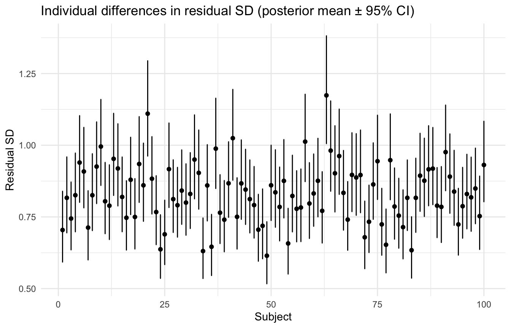{width=672}
:::
:::


See [Aristodemou, M. E. (2025). The temporal instability of cognitive performance (Doctoral dissertation)](https://doi.org/10.54195/9789465151182) for more information on the drawbacks of using simple metrics like e.g., iSD and iCV in comparison to DSEM. 

## Drift Diffusion Modeling (DDM)

### Description

The Drift Diffusion Model (DDM) is a statistical framework used to model (2-) choice response time data and is generally comprised of 4 parameters.

The drift rate parameter $\delta$ generally reflects how efficient or fast one accumulates evidence, the boundary separation parameter $\alpha$ reflects the degree of
response caution, the bias parameter $\beta$ reflects the starting point of evidence
accumulation, and the non-decision time parameter $\tau$ reflects processes that occur beyond the decision making such as enconding or perceptual and motor
processing time.

$$
\text{RT} \sim \text{Wiener}(\delta, \alpha, \beta, \tau)
$$

Cognitive variability is often operationalized through the drift rate, where higher drift rates generally indicate that evidence is accumulated more consistently which would reflect more precise and accurate cognitive processing. 

::: {.callout-note}
This code is adapted from the `easyRT` tutorial by Makowski (2023). For a thorough explanation on Drift Diffusion Models we refer to: Makowski D (2023). *easyRT: Tools and Examples for
Fitting (Hierarchical) Drift Diffusion Models in R*. R package version 0.1.0.
The code of `easyRT` is available at: https://dominiquemakowski.github.io/easyRT
:::

::: {.callout-note}
Here we use the dataset from the easyRT tutorial. 
This model is fit using R-package`brms` with 4 chains. Similar to DSEM, expect some sampling time.
:::

### Code

In this example, Makowski (2023) simulated data for 4 conditions with known parameters and investigated how well these parameters were recovered. For more background information about this dataset, see [here](https://dominiquemakowski.github.io/easyRT/articles/ddm.html)

#### Simulate DDM data


::: {.cell}

```{.r .cell-code  code-fold="false"}
# Simulate DDM data. Code from: https://dominiquemakowski.github.io/easyRT/articles/ddm.html
sim <- ddm_data(n     = c(200, 200, 200, 200),
                drift = c(-1, 0, 1, 2),
                bs    = 1,
                bias  = c(0.4, 0.5, 0.6, 0.7),
                ndt   = 0.2)

# store in df
df_ddm <- sim$data

# convert condition to 0, 1, 2, 3 (following easyRT tutorial)
df_ddm$condition <- as.numeric(df_ddm$condition) - 1

# inspect df
head(df_ddm)
```

::: {.cell-output .cell-output-stdout}

```
         rt response condition
1 0.4361185    lower         0
2 0.5964422    upper         0
3 0.3502312    lower         0
4 0.7368647    lower         0
5 0.4789399    lower         0
6 0.5273090    lower         0
```


:::
:::


#### Plot simulated data


::: {.cell}

```{.r .cell-code  code-fold="false"}
ddm_plot(sim)
```

::: {.cell-output-display}
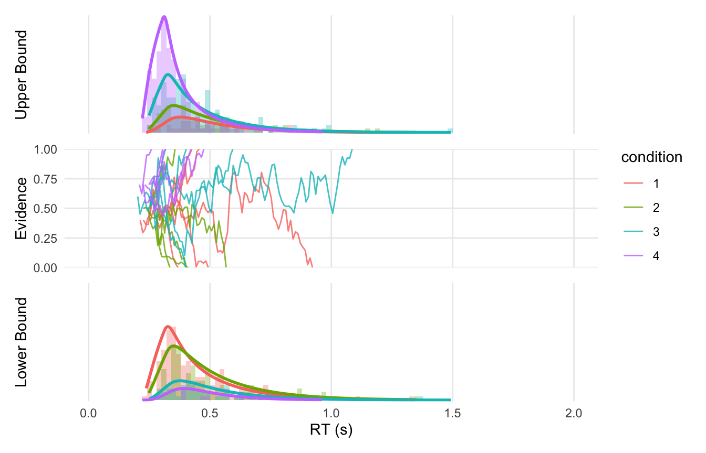{width=672}
:::
:::


#### Specify model formula, set priors and fit model (following easyRT tutorial)

::: {.cell}

```{.r .cell-code  code-fold="false"}
# Specify model formula and family
formula <- bf(rt | dec(response) ~ 0 + Intercept + condition,
              bias             ~ 0 + Intercept + condition)

family <- wiener(link_bs   = "identity",
                 link_ndt  = "identity",
                 link_bias = "identity")

# Specify priors
prior <- c(
  prior("student_t(3, 0, 1)",      class = "b", coef = "condition",  dpar = ""),
  set_prior("student_t(3, 0, 1)",  class = "b", coef = "Intercept",  dpar = ""),
  set_prior("student_t(3, 0, 0.05)", class = "b", coef = "condition", dpar = "bias"),
  set_prior("normal(0.5, 0.15)",   class = "b", coef = "Intercept",  dpar = "bias"),
  set_prior("gamma(1.5, 3)",       class = "ndt", ub = "min_Y"),
  set_prior("gamma(3, 2)",         class = "bs")
) |> brms::validate_prior(formula, family = family, data = df_ddm)

# Prepare prior data
prior_data <- brms:::prepare_print_prior(prior) |> 
  mutate(ub = ifelse(ub == "min_Y", min(df_ddm$rt), ub),
         Parameter = ifelse(coef != "", paste0(class, "_", coef), class)
  ) |> 
  filter(Parameter != "b") |> 
  ggdist::parse_dist()  


# Initialisation function
init_func <- function(chain_id = 1) {
  list(b      = rep(0, 2),
       b_bias = c(0.5, 0),
       bs     = 1,
       ndt    = 0.2)
}

# Fit model
m_ddm <- brm(formula,
             data      = df_ddm,
             family    = family,
             prior     = prior,
             cores     = 4,
             chains    = 4,
             warmup    = 500,
             iter      = 1500,
             algorithm = "sampling",
             init      = init_func)
```

::: {.cell-output .cell-output-stdout}

```
Running /Library/Frameworks/R.framework/Resources/bin/R CMD SHLIB foo.c
using C compiler: ‘Apple clang version 15.0.0 (clang-1500.3.9.4)’
using SDK: ‘MacOSX14.4.sdk’
clang -arch arm64 -std=gnu2x -I"/Library/Frameworks/R.framework/Resources/include" -DNDEBUG   -I"/Library/Frameworks/R.framework/Versions/4.5-arm64/Resources/library/Rcpp/include/"  -I"/Library/Frameworks/R.framework/Versions/4.5-arm64/Resources/library/RcppEigen/include/"  -I"/Library/Frameworks/R.framework/Versions/4.5-arm64/Resources/library/RcppEigen/include/unsupported"  -I"/Library/Frameworks/R.framework/Versions/4.5-arm64/Resources/library/BH/include" -I"/Library/Frameworks/R.framework/Versions/4.5-arm64/Resources/library/StanHeaders/include/src/"  -I"/Library/Frameworks/R.framework/Versions/4.5-arm64/Resources/library/StanHeaders/include/"  -I"/Library/Frameworks/R.framework/Versions/4.5-arm64/Resources/library/RcppParallel/include/"  -I"/Library/Frameworks/R.framework/Versions/4.5-arm64/Resources/library/rstan/include" -DEIGEN_NO_DEBUG  -DBOOST_DISABLE_ASSERTS  -DBOOST_PENDING_INTEGER_LOG2_HPP  -DSTAN_THREADS  -DUSE_STANC3 -DSTRICT_R_HEADERS  -DBOOST_PHOENIX_NO_VARIADIC_EXPRESSION  -D_HAS_AUTO_PTR_ETC=0  -include '/Library/Frameworks/R.framework/Versions/4.5-arm64/Resources/library/StanHeaders/include/stan/math/prim/fun/Eigen.hpp'  -D_REENTRANT -DRCPP_PARALLEL_USE_TBB=1   -I/opt/R/arm64/include    -fPIC  -falign-functions=64 -Wall -g -O2  -c foo.c -o foo.o
In file included from <built-in>:1:
In file included from /Library/Frameworks/R.framework/Versions/4.5-arm64/Resources/library/StanHeaders/include/stan/math/prim/fun/Eigen.hpp:22:
In file included from /Library/Frameworks/R.framework/Versions/4.5-arm64/Resources/library/RcppEigen/include/Eigen/Dense:1:
In file included from /Library/Frameworks/R.framework/Versions/4.5-arm64/Resources/library/RcppEigen/include/Eigen/Core:19:
/Library/Frameworks/R.framework/Versions/4.5-arm64/Resources/library/RcppEigen/include/Eigen/src/Core/util/Macros.h:679:10: fatal error: 'cmath' file not found
#include <cmath>
         ^~~~~~~
1 error generated.
make: *** [foo.o] Error 1
```


:::

```{.r .cell-code  code-fold="false"}
saveRDS(m_ddm, "m_ddm.rds")
```
:::


### Results

#### Model output


::: {.cell}

```{.r .cell-code  code-fold="false"}
m_ddm
```

::: {.cell-output .cell-output-stdout}

```
 Family: wiener 
  Links: mu = identity; bias = identity 
Formula: rt | dec(response) ~ 0 + Intercept + condition 
         bias ~ 0 + Intercept + condition
   Data: df_ddm (Number of observations: 800) 
  Draws: 4 chains, each with iter = 1500; warmup = 500; thin = 1;
         total post-warmup draws = 4000

Regression Coefficients:
               Estimate Est.Error l-95% CI u-95% CI Rhat Bulk_ESS Tail_ESS
Intercept         -1.37      0.14    -1.64    -1.10 1.00     2111     2539
condition          1.31      0.09     1.14     1.48 1.00     2026     2327
bias_Intercept     0.50      0.02     0.46     0.54 1.00     2072     2603
bias_condition     0.01      0.01    -0.02     0.03 1.00     1924     2354

Further Distributional Parameters:
    Estimate Est.Error l-95% CI u-95% CI Rhat Bulk_ESS Tail_ESS
bs      1.18      0.02     1.14     1.22 1.00     3281     2419
ndt     0.19      0.00     0.19     0.20 1.00     2429     2314

Draws were sampled using sampling(NUTS). For each parameter, Bulk_ESS
and Tail_ESS are effective sample size measures, and Rhat is the potential
scale reduction factor on split chains (at convergence, Rhat = 1).
```


:::
:::


#### Plot parameter estimates


::: {.cell}

```{.r .cell-code  code-fold="false"}
# Extract and plot parameter estimates
as.data.frame(m_ddm) |> 
  select(b_condition_bias = b_bias_condition, b_Intercept_bias = b_bias_Intercept, b_condition, b_Intercept, bs, ndt) |> 
  datawizard::data_to_long(names_to="Parameter", rows_to = "iter") |> 
  ggplot(aes(y = Parameter)) +
  ggdist::stat_halfeye(data = prior_data, aes(xdist = .dist_obj), geom = "slab", n = 10001, normalize="xy") +
  # ggdist::stat_dotsinterval(aes(x = value, fill = Parameter), color = "black", slab_linewidth = NA, scale = 1, dotsize = 2, normalize = "xy") +
  ggdist::stat_slabinterval(aes(x = value, fill = Parameter), slab_linewidth = NA, scale = 1, normalize = "xy") +
  geom_vline(xintercept = 0, linetype = "dashed") + 
  coord_cartesian(xlim = c(-2.5, 5)) +
  theme_minimal()
```

::: {.cell-output-display}
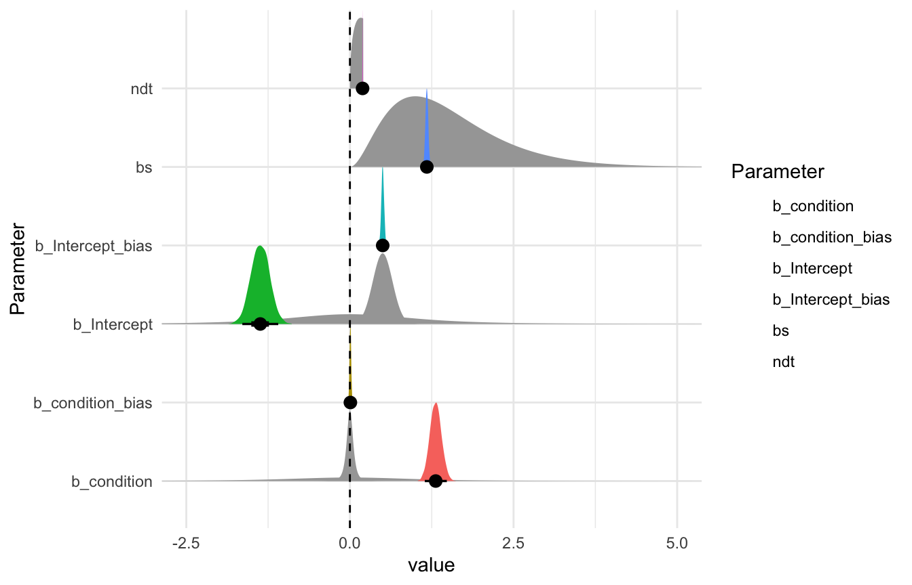{width=672}
:::
:::


- **`b_Intercept`** — baseline drift rate (when condition = 0)
- **`b_condition`** — effect of condition on drift rate
- **`b_Intercept_bias`**— baseline bias (when condition = 0)
- **`b_condition_bias`** — effect of condition on bias
- **`bs`** — boundary separation
- **`ndt`** — non-decision time

::: {.callout-note}
This DDM estimates population-level parameters. In order to get subject-specific drift rate estimates, like the subject-specific innovations in our DSEM, one would require a multilevel extension with random effects for each subject.
:::

## Relative variability indices

[Mestdagh et al., (2018)](https://psycnet.apa.org/buy/2018-15177-001) propose a battery of 'Relative Variability Indices' that aim to circumvent the problem of mean-dependence within some of the traditional variability measures (e.g., SD). Variability is computed in relation to the maximum possible variability conditional on the mean. 

::: {.callout-note}
Relative Variability measures are suitable for double bounded data (e.g., VAS 0-100), but less suitable if the observed data have no double scale bounds (e.g., response times).
:::

### Overview of Relative Variability Estimates
| Variability Estimate | Conceptual Strength | Conceptual Limitation | Suits Data Type |
|---|---|---|---|
| **Relative Standard Deviation (iSD)** | Mean-corrected; removes dependency between mean and SD induced by bounded scales | Inflates variability estimates near scale bounds; assumes participants use the entire scale range; participants with mean at bounds should be excluded | Continuous bounded data (e.g., Likert, VAS, ESM affective ratings) |
| **Relative RMSSD (rRMSSD)** | Mean-corrected; captures temporal instability independent of mean level; suitable for time-ordered data | Inflates estimates near bounds; requires time-ordered observations; conflates autocorrelation with innovations | Time-ordered bounded continuous data (e.g., ESM affective ratings) |
| **Relative Interquartile Range (rIQR)** | Mean-corrected; robust to outliers compared to SD measures | Inflates estimates near bounds; less sensitive to extreme fluctuations; participants with mean at bounds should be excluded | Continuous bounded data, particularly with skewed distributions |
| **Relative Range (rR)** | Mean-corrected; captures the full spread of scores relative to what is possible given the mean | Sensitive to outliers and extreme observations; inflates estimates near bounds; based on only two observations (min and max) | Continuous bounded data where entire range is of (theoretical) interest |
: Overview of Relative Variability estimates, their strengths, limitations, and suitable data types. {#tbl-overview .striped .hover}


#### Step 1: Download the source files

Source files for the Relative variability indices in R can be found [here:](https://ppw.kuleuven.be/okp/software/relative_variability/)

#### Step 2: Read in the provided data: ESMData.rda 

::: {.cell}

```{.r .cell-code  code-fold="false"}
load("ESMData.rda")
ESMData %>% 
  dplyr::filter(ID %in% unique(ID)[1:5]) %>% 
  group_by(ID) %>% 
  slice_head(n = 5) %>% 
  knitr::kable()
```

::: {.cell-output-display}


| ID| Sad| CESD|
|--:|---:|----:|
|  2|  12| 0.45|
|  2|  20| 0.45|
|  2|  58| 0.45|
|  2| NaN| 0.45|
|  2|   1| 0.45|
|  3|  16| 0.50|
|  3|  13| 0.50|
|  3|  16| 0.50|
|  3|  10| 0.50|
|  3|  26| 0.50|
|  4| NaN| 0.80|
|  4|  17| 0.80|
|  4|   9| 0.80|
|  4|  16| 0.80|
|  4| NaN| 0.80|
|  6| NaN| 0.65|
|  6|   5| 0.65|
|  6|  12| 0.65|
|  6| NaN| 0.65|
|  6|   6| 0.65|
|  8| NaN| 0.30|
|  8|  12| 0.30|
|  8|  12| 0.30|
|  8|   5| 0.30|
|  8|   3| 0.30|


:::
:::


Here we only show the first 5 rows of 5 different subjects, however there are more subject and each subject has more than 5 observations. 

What does each variable reflect?

- **`ID`**: Subject ID number 
- **`Sad`**: Slider score 
- **`CESD`**: Depression scale score


#### Determine scale bounds


::: {.cell}

```{.r .cell-code  code-fold="false"}
MIN_val <- min(ESMData$Sad, na.rm = TRUE) 
MAX_val <- max(ESMData$Sad, na.rm = TRUE)
```
:::


#### Step 3: Source the files from the folder you downloaded the source files to and estimate measures

::: {.cell}

```{.r .cell-code  code-fold="false"}
source("bestDivision.R")
source("checkInput.R")
source("checkOutput.R")
source("IPR.R")
source("IQR.R")
source("maximumIQR.R")
source("maximumVAR.R")
source("maximumIPR.R")
source("maximumRMSSD.R")
source("maximumMSSD.R")
source("maximumRANGE.R")
source("maximumSD.R")
source("maxMssdGetN.R")
source("mostLeast.R")
source("mssdParts.R")
source("RMSSD.R")
source("MSSD.R")
source("RANGE.R")
source("tryAdd.R")
source("updateUseFill.R")

# source the relative measures
source("relativeSD.R")
source("relativeVAR.R")
source("relativeIQR.R")
source("relativeRANGE.R")
source("relativeRMSSD.R")
source("relativeMSSD.R")

results <- ESMData %>%
  group_by(ID) %>%
  summarise(
    SD_rel    = relativeSD(Sad,    MIN = MIN_val, MAX = MAX_val),
    RMSSD_rel = relativeRMSSD(Sad, MIN = MIN_val, MAX = MAX_val),
    IQR_rel   = relativeIQR(Sad,   MIN = MIN_val, MAX = MAX_val),
    RANGE_rel = relativeRANGE(Sad, MIN = MIN_val, MAX = MAX_val)
  )
```
:::


The relative SD formula is:
$$
\text{RSD}_i^* = \frac{\sigma_{X_i}}{\sigma_{\max}(\bar{X}_i, \text{MIN}, \text{MAX}, n_i)}
$$

where

$$
\sigma_{X_i} = \sqrt{\frac{1}{n_i-1}\sum_{j=1}^{n_i}(x_{i,j} - \bar{X}_i)^2}
$$

and $\sigma_{\max}$ is the maximum possible standard deviation given the observed 
mean $\bar{X}_i$, the bounds $[\text{MIN}, \text{MAX}]$, and sample size $n_i$.

$$
\text{RSD}_i^* = \begin{cases} 
\dfrac{\sigma_{X_i}}{\sigma_{\max}} & \text{if } \sigma_{\max} \neq 0 \\ 
\text{NaN} & \text{if } \sigma_{\max} = 0 
\end{cases}
$$

The relative rMSSD formula is:

$$
\text{RMSSD}_i^* = \frac{\text{RMSSD}_i}{\sigma_{\max}(\bar{X}_i, \text{MIN}, \text{MAX}, \mathbf{n})}
$$

where

$$
\text{RMSSD}_i = \sqrt{\frac{1}{n_i - 1} \sum_{j=1}^{n_i - 1} (x_{i,j+1} - x_{i,j})^2}
$$

and $\sigma_{\max}$ is the maximum possible RMSSD given the observed mean 
$\bar{X}_i$, the bounds $[\text{MIN}, \text{MAX}]$, and the segment lengths 
$\mathbf{n} = (n_1, n_2, \ldots)$.

$$
\text{RMSSD}_i^* = \begin{cases} 
\dfrac{\text{RMSSD}_i}{\sigma_{\max}} & \text{if } \sigma_{\max} \neq 0 \\ 
\text{NaN} & \text{if } \sigma_{\max} = 0 
\end{cases}
$$

The relative IQR formula is:

$$
\text{IQR}_i^* = \frac{\text{IQR}_i}{\sigma_{\max}(\bar{X}_i, \text{MIN}, \text{MAX}, n_i)}
$$

where

$$
\text{IQR}_i = Q_{0.75}(X_i) - Q_{0.25}(X_i)
$$

and $\sigma_{\max}$ is the maximum possible IQR given the observed mean 
$\bar{X}_i$, the bounds $[\text{MIN}, \text{MAX}]$, the sample size $n_i$, 
and the quartile positions $n_1 = \lceil n_i \cdot 0.25 \rceil$ and 
$n_2 = \lceil n_i \cdot 0.75 \rceil$.

$$
\text{IQR}_i^* = \begin{cases} 
\dfrac{\text{IQR}_i}{\sigma_{\max}} & \text{if } \sigma_{\max} \neq 0 \\ 
\text{NaN} & \text{if } \sigma_{\max} = 0 
\end{cases}
$$

The relative Range formula is:

$$
\text{R}_i^* = \frac{R_i}{\max(R_i \mid M_i)}
$$

where

$$
R_i = \max(X_i) - \min(X_i)
$$

and $\max(R_i \mid M_i)$ is the maximum possible range given the observed mean $M_i$,
the bounds $[\text{MIN}, \text{MAX}]$, the sample size $n$, and the positions
$n_1 = 1$ and $n_2 = n$.

$$
\text{R}^* = \begin{cases} \dfrac{R_i}{\max(R_i \mid M_i)} & \text{if } \max(R_i \mid M_i) \neq 0 \\ \text{NaN} & \text{if } \max(R_i \mid M_i) = 0 \end{cases}
$$


#### Results


::: {.cell}

```{.r .cell-code  code-fold="false"}
results %>%
  pivot_longer(-ID, names_to = "estimate", values_to = "value") %>%
  group_by(estimate) %>%
  mutate(m = mean(value, na.rm = TRUE)) %>%
  ggplot(aes(x = value)) +
  geom_histogram(bins = 40, fill = "#4C72B0", colour = "white", alpha = 0.8) +
  geom_vline(aes(xintercept = m), linetype = "dashed") +
  geom_text(aes(x = m, y = Inf,
                label = paste0("M = ", round(m, 2))),
            hjust = -0.1, vjust = 2, size = 3.2, check_overlap = TRUE) +
  facet_wrap(~estimate, scales = "free_x") +
  theme_minimal() +
  labs(title = "Distribution of relative variability estimates",
       x = NULL, y = "Count")
```

::: {.cell-output-display}
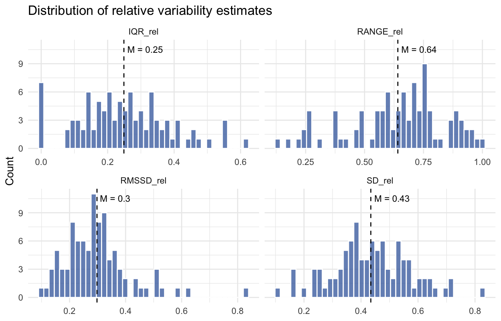{width=672}
:::
:::


## Binary variability measures

::: {.callout-note}
This collection of measures is based on the work led by PhD student [Aline Korver](https://orcid.org/0009-0000-4996-6170) and is derived from her Master thesis and forthcoming manuscript. All R code credentials here go to Aline Korver.
:::

A final extension of this tutorial concerns measures that are specifically tailored to estimate variability in binary data. Most measures discussed earlier are suitable for continuous (e.g., response time) data, but cannot or are limited in their ability to capture dynamics in accuracy data. Korver's work tries to 'close the methodological gap' between measures of variability for continuous data and measures that estimate variability in binary data. 

### Overview of variability measures for binary data
| Variability Estimate | Conceptual Strength | Conceptual Limitation | Suits Data Type |
|---|---|---|---|
| **Autocorrelation** | Easy to compute, not mean dependent | Assumes of stationarity | Continuous & Binary (0/1) data |
| **Hurst exponent** | Easy to compute, estimates long-range dependence across multiple timescales | Mean-dependent | Continuous & Binary (0/1) data  |
| **Correct and error streakiness** | Easy to compute | Mean-dependent, assumes stationarity | Binary (0/1) data |
| **Mean Square of Successive Differences (MSSD)** | Easy to compute, suitable for binary data | Conflates autocorrelation with innovations and systematic changes | Binary (0/1) data, continuous data |
| **Burstiness** | Easy to compute | Mean-dependent | Binary (0/1) data |
| **Windowed SD** | Easy to compute | Mean-dependent, (arbitrary) window size choice | Continuous & Binary (0/1) data | 
: Overview of Binary variability estimates, their strengths, limitations, and suitable data types. {#tbl-overview .striped .hover}

Crucially, most measures (except the autocorrelation) have a mathematical dependency with mean proportion correct. Explaining the reasons why is beyond the scope of this tutorial but will be discussed in Korver's forthcoming paper. However, applying a 'standardization' procedure to each measure allows us to get rid of the mean-dependency and makes inter-measure comparisons of variability in binary data possible. All measures discussed below (except for the autocorrelation) are standardized estimates.

### Autocorrelation
Contrary to the autocorrelation in continuous data, the autocorrelation in binary data indicates the degree to which (in-)correct responses are to be followed by another (in-)correct response. 

The autocorrelation is defined as: 

$$
\text{autocor}_{raw} = \text{cor}(x_t, x_{t-n})
$$

and is a priori not 'contaminated' through mean-dependency, making it the only measure where the raw estimate can be used [Schmiedek et al., (2020)](10.7717/peerj.9290).

### Hurst exponent 

With its origins in the field of [Hydrology](https://doi.org/10.1061/TACEAT.0006518), the Hurst exponent captures variability across a time-series which is segmented into equal pieces, where after 'demeaning' and 'rescaling' where the slope of the regression line in each segment represents the estimated Hurst exponent. To calculate the Hurst exponent, we make use of the R-package [pracma](https://cran.r-project.org/web/packages/pracma/index.html)

### Correct and error streakiness 

Next to the overall streakiness in a binary time-series (i.e., autocorrelation) one could be interested in the separating the overall autocorrelation into a parameter that describes the degree of correct and / or error streakiness.

For instance, correct streakiness could be of interest when studying levels of attentiveness whereas error streakiness could be studied when interested in post error behavior.

The metric reported here is the Range standardized residualized error-streakiness and is derived following 4 mathematical formulas:

Formula 1: raw error-streakiness

$$
\text{errstreak}_{\text{raw}} = P(x_t = 0 \mid x_{t-1} = 0)
$$

Formula 2: Extra error-streakiness (removes asymmetric mean-dependency)

$$
\text{errstreak}_{\text{extra}} = \text{errstreak}_{\text{raw}} - (1 - p)
$$

Formula 3: Range-standardized error-streakiness (removes range mean-dependency)

$$
\text{errstreak}_{\text{rangestd}} = \frac{\text{errstreak}_{\text{extra}} - \text{errstreak}_{\text{min}}}{\text{errstreak}_{\text{max}} - \text{errstreak}_{\text{min}}}
$$

Formula 4: Range-standardized residualized error-streakiness (removes mid-point bias introduced in formula 3)

$$
\text{errstreak}_{\text{rangestd\_res}} = \text{errstreak}_{\text{rangestd}} - \frac{0 - \text{errstreak}_{\text{min}}}{\text{errstreak}_{\text{max}} - \text{errstreak}_{\text{min}}}
$$

::: {.callout-note}
The formulas for correct-streakiness are the (semantic) contrary of the error streakiness.
:::

### Mean Squared of Successive Differences (MSSD)

The MSSD in binary data basically indicates the degree of 'ups and downs' across consecutive trials. The raw MSSD can be computed through:

Formula 1: raw MSSD
$$
\text{MSSD}_{\text{raw}} = \frac{\sum_{i=1}^{n-1}(x_{i+1} - x_i)^2}{n-1}
$$

However, there is a mean-dependency here (i.e., curvilinear relation to the mean and greater spread
for middle values). We can correct for this by expressing the raw MSSD as its position relative to the minimum and maximum possible values which is called the range-standardized MSSD.

Formula 2: range-standardized MSSD

$$
\text{MSSD}_{\text{rangestd}} = \frac{\text{MSSD}_{\text{raw}} - \text{MSSD}_{\text{min}}}{\text{MSSD}_{\text{max}} - \text{MSSD}_{\text{min}}}
$$

However, there still is a mean dependency because when having a low mean proportion correct it is difficult to reach the theoretical maximum compared to having a high mean proportion correct. 

To circumvent this dependency we can create a predicted MSSD drawn from a random binary
time series, where for the proportion correct **`p`**, the predicted
MSSD is the probability of transitioning from 1 to 0, or 0 to 1.

Formula 3: removes mean-dependency

$$
\text{MSSD}_{\text{pred}} = P(1 \rightarrow 0) + P(0 \rightarrow 1) = p*(1-p) + (1-p)*p = 2p(1-p)
$$

Finally, we derive a residualized MSSD that indicates the difference between the observed
raw MSSD and predicted MSSD:

Formula 4: residualized MSSD

$$
\text{MSSD}_{\text{res}} = \text{MSSD}_{\text{raw}} - \text{MSSD}_{\text{pred}}
$$

This range-restricted residualized MSSD can be interpreted as how (un)stable the time series behaves,
in comparison the prediction from random data.Positive values mean greater instability than expected by chance, where negative values reflect greater stability.


### Burstiness 

Burstiness refers to the tendency of event types (error/correct) to cluster and is computed from the mean and standard deviation of intervals between 'events'.

The bustiness of errors is calculated through formula 1.

Formula 1: 
$$
\text{Err}_{\text{burst}_{\text{raw}}} = \frac{\sigma_{\text{int}} - \mu_{\text{int}}}{\sigma_{\text{int}} + \mu_{\text{int}}}
$$

However, this does not get rid of mean-dependency and results in a negative bias. Therefore, we can compute a standardized Burstiness score which is the sum of residualized error and correct burstiness:

Formula 2:
$$
\text{burst}_\text{std} = \text{burst}_\text{err} + \text{burst}_\text{cor}
$$

This combined measure reduces (but does not fully eliminate) the negative bias, which is most pronounced at extreme proportions correct.


### Windowed Standard Deviation 

The windowed SD is computed by taking the mean proportion correct over a sliding window of $w$ and computing the standard deviation over these windowed means.Here, maximally overlapping windows are used, wrapping around to the start of the series after the last window, so that every trial contributes equally to the same number of windows. The raw windowed SD has a mean dependency, which can be - to an extend - corrected for by residualizing against the predicted windowed SD:

$$
\text{winSD}_{\text{res}} = \frac{\sqrt{p*(1-p)}}{{w}}
$$

Alas, this measure does not allow exact range-standardization, but can be interpreted as being relatively stable or unstable compared to a random time-series.

### Estimate binary variability measures

#### Set up

::: {.cell}

```{.r .cell-code  code-fold="false"}
# The "source" section loads a convenient plot_meas function, which allows
# you to plot 9 time series with the the 3 lowest, mid, and highest scores on a
# certain binary measure.

## load packages
library(psych)
library(pracma)
library(stats)
library(ggplot2)
library(reshape2)

## source functions
source("Bivar_functions.R")
source("PlotMeasures_Function.R")
```
:::


The following set of functions are now available in the R environment:

- **`bi_ac()`** --> computes binary autocorrelation
- **`bi_Hu()`** --> computes binary Hurst exponent
- **`bi_mssd()`** --> computes binary MSSD 
- **`burst()`** --> computes Burstiness
- **`cor_err_streak()`** --> computes Correct and Error streakiness
- **`window_SD()`** --> computes Windowed Standard Deviation
- **`plot_meas()`** --> plots time series for the 3 lowest, middle, and highest 
values for a certain measure. 

For the MSSD, burstiness, correct/error streakiness, and windowed SD, a "standardization procedure" is performed. 
The functions will output the standardized value by default; it is also 
possible to specify that you want the "raw" or partly standardized values
(see the Bivar_Functions.R script for more information).

The functions accept data frames with a time series per row as input (i.e. like
the 'ts' data frame that we simulate below).
The output is a vector or a data frame with values.


#### Simulate data 

The data is simulated as follows: a time-series of normally distributed,
moderately positive autocorrelations and means, and generated continuous
time series, which were dichotomized into 0/1 (based on
the continuous value being below or above 0).


::: {.cell}

```{.r .cell-code  code-fold="false"}
# set seed & create empty time series df
set.seed(1108)
ts <- matrix(nrow = 100, ncol = 100)
ts <- as.data.frame(ts)

# create range of autocorrelations
sim_acs = rnorm(100, mean=0.3, sd=0.15)
sim_acs = ifelse(sim_acs>.99, .99, sim_acs)

# simulate autocorrelated time series and dichotomize
for (row in 1:100) {sim = arima.sim(list(ar=sim_acs[row], ma=0), n=100) + rnorm(1, mean=.5, sd=.3)
ts[row,1:100] <- ifelse(sim<0, 0, 1)}

# create df and add percentage correct and subject ID variable
df = ts
df$pcor = rowMeans(ts)
df$ID = as.factor(1:nrow(ts))
```
:::


##### Estimate Autocorrelation

::: {.cell}

```{.r .cell-code  code-fold="false"}
# Compute Autocorrelation
autocorrelation = bi_ac(ts)

# Look at the distribution of values
ggplot(data.frame(x = autocorrelation), aes(x = x)) +
  geom_histogram(bins = 40, fill = "#4C72B0", colour = "white", alpha = .8) +
  geom_vline(xintercept = mean(autocorrelation), linetype = "dashed") +
  labs(title = "Distribution of Simulated Autocorrelations",
       x = "Value", y = "Count") +
  theme_minimal()
```

::: {.cell-output-display}
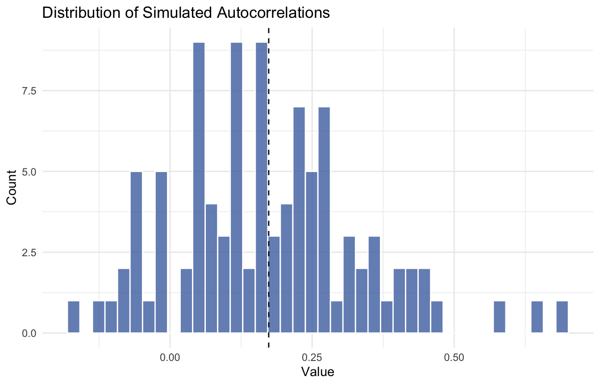{width=672}
:::

```{.r .cell-code  code-fold="false"}
# Plot the time series with the 3 lowest, middle, and highest values:
plot_meas(ts, autocorrelation, "Autocorrelation")
```

::: {.cell-output-display}
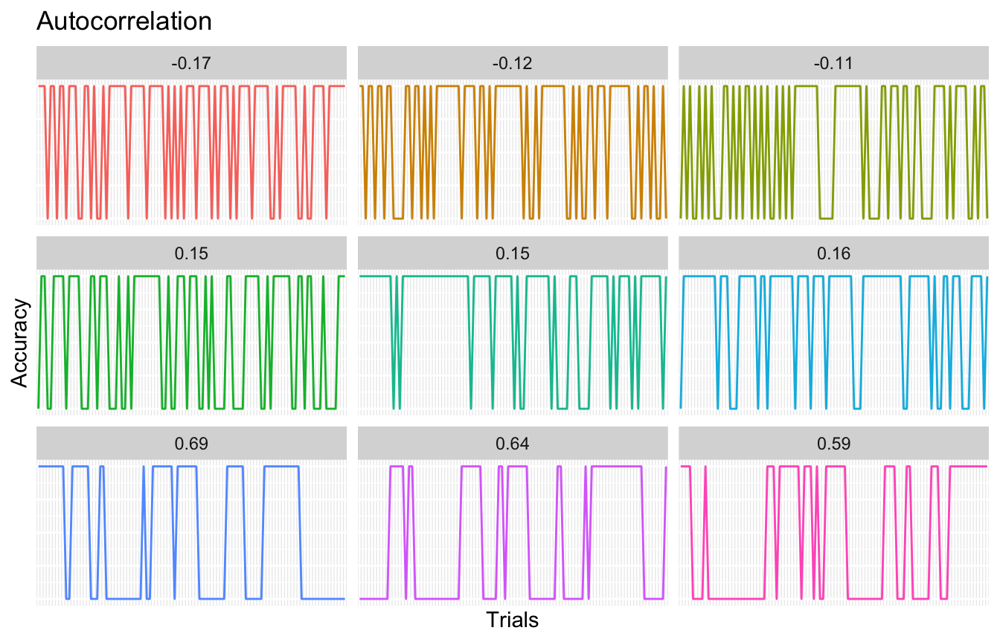{width=672}
:::
:::


##### Estimate Hurst exponent

::: {.cell}

```{.r .cell-code  code-fold="false"}
# Compute Hurst exponent, look at distribution
Hurst_exponent = bi_Hu(ts)

ggplot(data.frame(x = Hurst_exponent), aes(x = x)) +
  geom_histogram(bins = 40, fill = "#4C72B0", colour = "white", alpha = .8) +
  geom_vline(xintercept = mean(Hurst_exponent), linetype = "dashed") +
  labs(title = "Distribution of Simulated Hurst exponents",
       x = "Value", y = "Count") +
  theme_minimal()
```

::: {.cell-output-display}
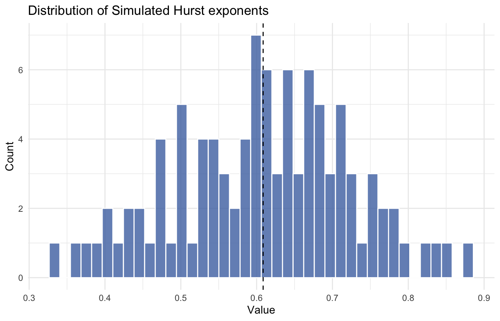{width=672}
:::

```{.r .cell-code  code-fold="false"}
# Plot the time series with the 3 lowest, middle, and highest values:
plot_meas(ts, Hurst_exponent, "Hurst_exponent")
```

::: {.cell-output-display}
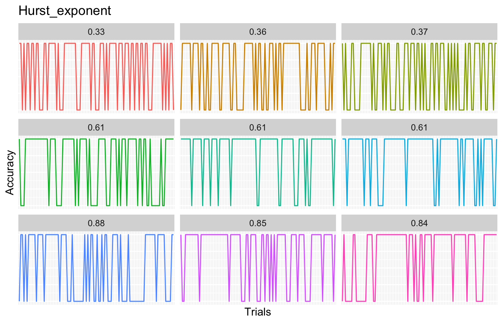{width=672}
:::
:::


##### Estimate Streakiness

::: {.cell}

```{.r .cell-code  code-fold="false"}
# Compute correct and error streakiness; note that here the output is a 
# data frame with one column for correct and one for error streakiness
streaks = cor_err_streak(ts)

# Look at distributions
ggplot(data.frame(x = streaks$corstreak), aes(x = x)) +
  geom_histogram(bins = 40, fill = "#4C72B0", colour = "white", alpha = .8) +
  geom_vline(xintercept = mean(streaks$corstreak), linetype = "dashed") +
  labs(title = "Distribution of Simulated Correct streaks",
       x = "Value", y = "Count") +
  theme_minimal()
```

::: {.cell-output-display}
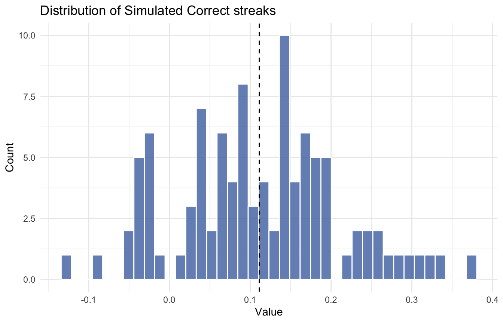{width=672}
:::

```{.r .cell-code  code-fold="false"}
ggplot(data.frame(x = streaks$errstreak), aes(x = x)) +
  geom_histogram(bins = 40, fill = "#4C72B0", colour = "white", alpha = .8) +
  geom_vline(xintercept = mean(streaks$errstreak), linetype = "dashed") +
  labs(title = "Distribution of Simulated Error streaks",
       x = "Value", y = "Count") +
  theme_minimal()
```

::: {.cell-output-display}
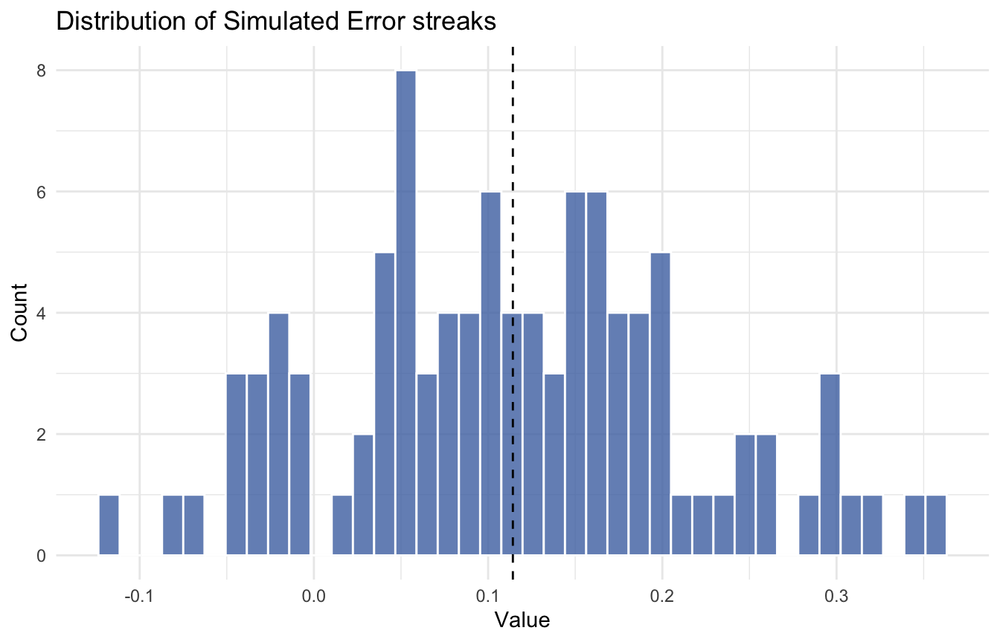{width=672}
:::

```{.r .cell-code  code-fold="false"}
# Plot the time series with the 3 lowest, middle, and highest values:
plot_meas(ts, streaks$corstreak, "Correct streakiness")
```

::: {.cell-output-display}
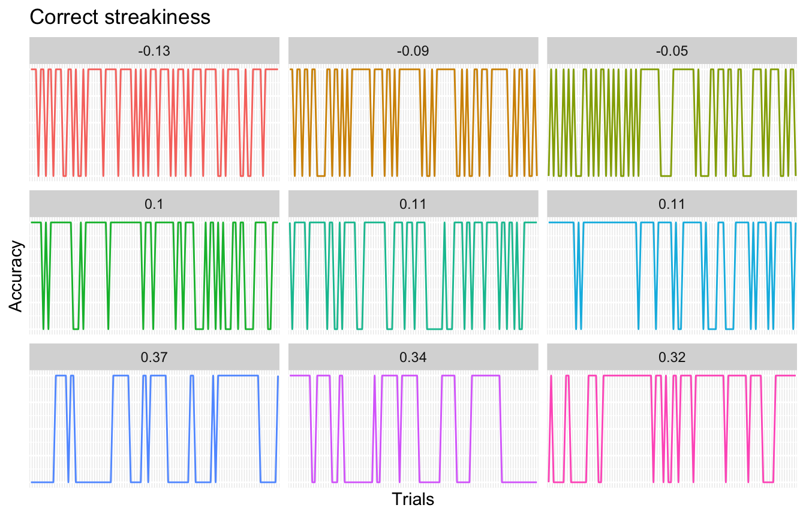{width=672}
:::

```{.r .cell-code  code-fold="false"}
plot_meas(ts, streaks$errstreak, "Error streakiness")
```

::: {.cell-output-display}
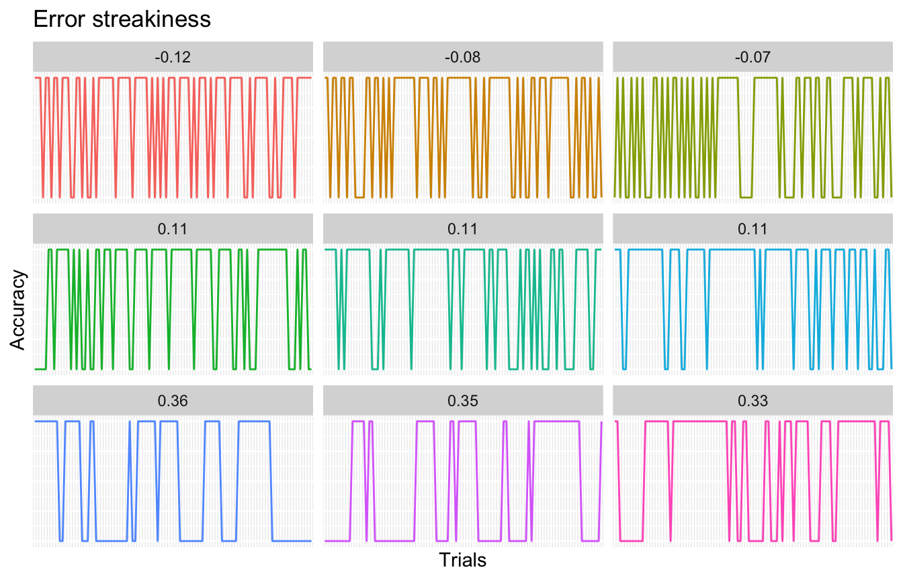{width=672}
:::
:::


##### Estimate MSSD

::: {.cell}

```{.r .cell-code  code-fold="false"}
# Compute MSSD, look at distribution
mssd = bi_mssd(ts)

ggplot(data.frame(x = mssd), aes(x = x)) +
  geom_histogram(bins = 40, fill = "#4C72B0", colour = "white", alpha = .8) +
  geom_vline(xintercept = mean(mssd), linetype = "dashed") +
  labs(title = "Distribution of Simulated MSSD",
       x = "Value", y = "Count") +
  theme_minimal()
```

::: {.cell-output-display}
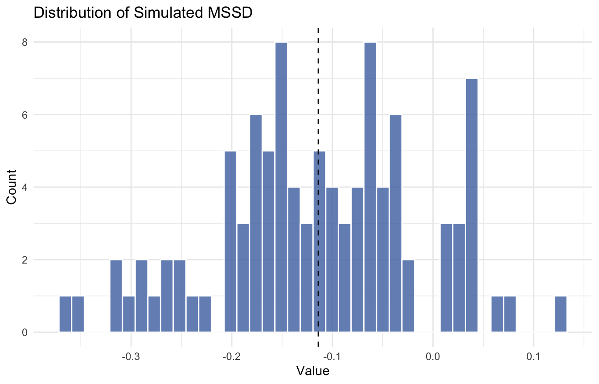{width=672}
:::

```{.r .cell-code  code-fold="false"}
# Plot the time series with the 3 lowest, middle, and highest values:
plot_meas(ts, mssd, "MSSD")
```

::: {.cell-output-display}
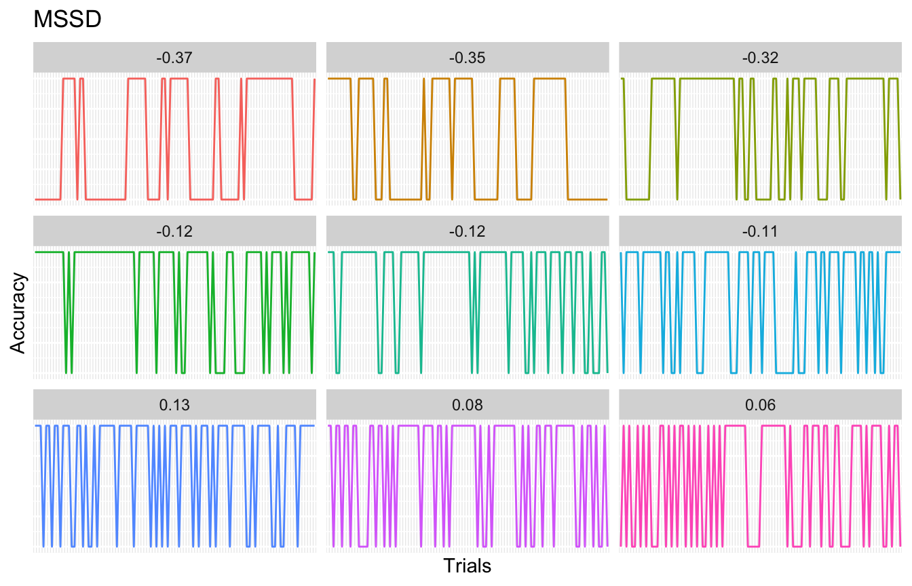{width=672}
:::
:::


##### Estimate Burstiness

::: {.cell}

```{.r .cell-code  code-fold="false"}
# Compute Burstiness, look at distribution
burstiness = burst(ts)

ggplot(data.frame(x = burstiness), aes(x = x)) +
  geom_histogram(bins = 40, fill = "#4C72B0", colour = "white", alpha = .8) +
  geom_vline(xintercept = mean(burstiness), linetype = "dashed") +
  labs(title = "Distribution of Simulated Burstiness",
       x = "Value", y = "Count") +
  theme_minimal()
```

::: {.cell-output-display}
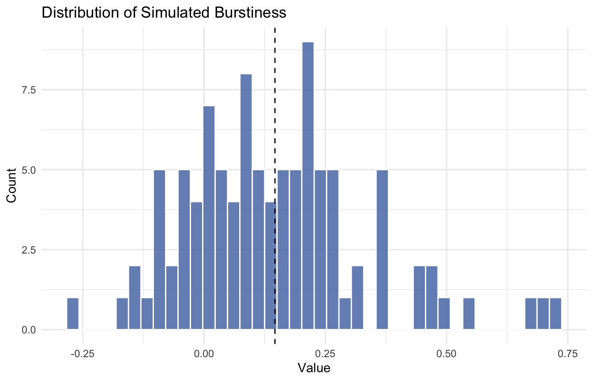{width=672}
:::

```{.r .cell-code  code-fold="false"}
# Plot the time series with the 3 lowest, middle, and highest values:
plot_meas(ts, burstiness, "Burstiness")
```

::: {.cell-output-display}
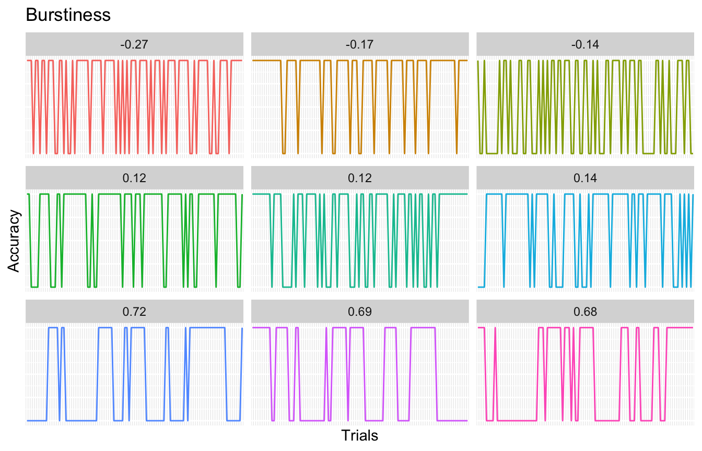{width=672}
:::
:::


##### Estimate Windowed SD

::: {.cell}

```{.r .cell-code  code-fold="false"}
# Compute Windowed SD, look at distribution
win_SD = window_SD(ts)

ggplot(data.frame(x = win_SD), aes(x = x)) +
  geom_histogram(bins = 40, fill = "#4C72B0", colour = "white", alpha = .8) +
  geom_vline(xintercept = mean(win_SD), linetype = "dashed") +
  labs(title = "Distribution of Simulated Windowed Standard Deviation",
       x = "Value", y = "Count") +
  theme_minimal()
```

::: {.cell-output-display}
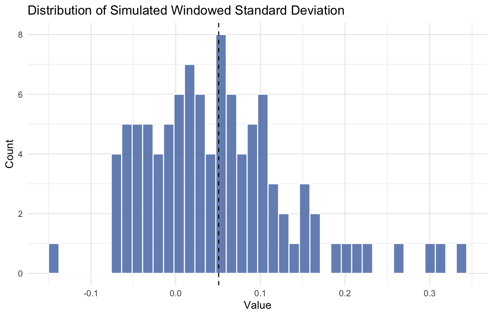{width=672}
:::

```{.r .cell-code  code-fold="false"}
# Plot the time series with the 3 lowest, middle, and highest values:
plot_meas(ts, win_SD, "Windowed Standard Deviation")
```

::: {.cell-output-display}
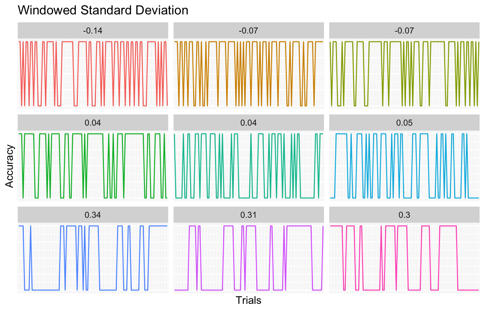{width=672}
:::
:::


# Conclusion 

Throughout this tutorial, we hope to have illustrated the breadth of statistical parameters, each with different strengths and weaknesses, with which researchers can estimate cognitive variability across different data types. This will help further empirical investigation of cognitive variability across a wide range of contexts, tasks and settings. Depending on the scientific question, cognitive process studied, experimental task design and the type of data collected, researchers can make an informed choice among the available metrics. 

# Appendix 

## Software Citations


```{.r .cell-code}
library(grateful)
library(formattable)

pkgs <- cite_packages(
  output = "table",
  bib.file = "grateful-refs.bib",
  out.dir = getwd(),
  cite.tidyverse = TRUE,
  include.RStudio = FALSE
)

formattable(
  pkgs,
  table.attr = 'class="table table-striped" style="font-size:13px; font-family:Lato; width:80%"'
)
```


<table class="table table-striped" style="font-size:13px; font-family:Lato; width:80%">
 <thead>
  <tr>
   <th style="text-align:right;"> Package </th>
   <th style="text-align:right;"> Version </th>
   <th style="text-align:right;"> Citation </th>
  </tr>
 </thead>
<tbody>
  <tr>
   <td style="text-align:right;"> base </td>
   <td style="text-align:right;"> 4.5.1 </td>
   <td style="text-align:right;"> @base </td>
  </tr>
  <tr>
   <td style="text-align:right;"> bayesplot </td>
   <td style="text-align:right;"> 1.14.0 </td>
   <td style="text-align:right;"> @bayesplot2019; @bayesplot2025 </td>
  </tr>
  <tr>
   <td style="text-align:right;"> beepr </td>
   <td style="text-align:right;"> 2.0 </td>
   <td style="text-align:right;"> @beepr </td>
  </tr>
  <tr>
   <td style="text-align:right;"> brms </td>
   <td style="text-align:right;"> 2.23.0 </td>
   <td style="text-align:right;"> @brms2017; @brms2018; @brms2021 </td>
  </tr>
  <tr>
   <td style="text-align:right;"> cmdstanr </td>
   <td style="text-align:right;"> 0.9.0.9000 </td>
   <td style="text-align:right;"> @cmdstanr </td>
  </tr>
  <tr>
   <td style="text-align:right;"> datawizard </td>
   <td style="text-align:right;"> 1.3.1 </td>
   <td style="text-align:right;"> @datawizard </td>
  </tr>
  <tr>
   <td style="text-align:right;"> easyRT </td>
   <td style="text-align:right;"> 0.1.0 </td>
   <td style="text-align:right;"> @easyRT </td>
  </tr>
  <tr>
   <td style="text-align:right;"> easystats </td>
   <td style="text-align:right;"> 0.7.6 </td>
   <td style="text-align:right;"> @easystats </td>
  </tr>
  <tr>
   <td style="text-align:right;"> effects </td>
   <td style="text-align:right;"> 4.2.5 </td>
   <td style="text-align:right;"> @effects2003; @effects2009; @effects2018; @effects2019 </td>
  </tr>
  <tr>
   <td style="text-align:right;"> ExGaussEstim </td>
   <td style="text-align:right;"> 0.1.2 </td>
   <td style="text-align:right;"> @ExGaussEstim </td>
  </tr>
  <tr>
   <td style="text-align:right;"> formattable </td>
   <td style="text-align:right;"> 0.2.1 </td>
   <td style="text-align:right;"> @formattable </td>
  </tr>
  <tr>
   <td style="text-align:right;"> ggdist </td>
   <td style="text-align:right;"> 3.3.3 </td>
   <td style="text-align:right;"> @ggdist2024; @ggdist2025 </td>
  </tr>
  <tr>
   <td style="text-align:right;"> kableExtra </td>
   <td style="text-align:right;"> 1.4.0 </td>
   <td style="text-align:right;"> @kableExtra </td>
  </tr>
  <tr>
   <td style="text-align:right;"> knitr </td>
   <td style="text-align:right;"> 1.50 </td>
   <td style="text-align:right;"> @knitr2014; @knitr2015; @knitr2025 </td>
  </tr>
  <tr>
   <td style="text-align:right;"> lme4 </td>
   <td style="text-align:right;"> 1.1.37 </td>
   <td style="text-align:right;"> @lme4 </td>
  </tr>
  <tr>
   <td style="text-align:right;"> MASS </td>
   <td style="text-align:right;"> 7.3.65 </td>
   <td style="text-align:right;"> @MASS </td>
  </tr>
  <tr>
   <td style="text-align:right;"> patchwork </td>
   <td style="text-align:right;"> 1.3.2 </td>
   <td style="text-align:right;"> @patchwork </td>
  </tr>
  <tr>
   <td style="text-align:right;"> posterior </td>
   <td style="text-align:right;"> 1.6.1 </td>
   <td style="text-align:right;"> @posterior2021b; @posterior2022d; @posterior2024c; @posterior2024e; @posterior2025a </td>
  </tr>
  <tr>
   <td style="text-align:right;"> pracma </td>
   <td style="text-align:right;"> 2.4.6 </td>
   <td style="text-align:right;"> @pracma </td>
  </tr>
  <tr>
   <td style="text-align:right;"> psych </td>
   <td style="text-align:right;"> 2.5.6 </td>
   <td style="text-align:right;"> @psych </td>
  </tr>
  <tr>
   <td style="text-align:right;"> remotes </td>
   <td style="text-align:right;"> 2.5.0 </td>
   <td style="text-align:right;"> @remotes </td>
  </tr>
  <tr>
   <td style="text-align:right;"> reshape2 </td>
   <td style="text-align:right;"> 1.4.4 </td>
   <td style="text-align:right;"> @reshape2 </td>
  </tr>
  <tr>
   <td style="text-align:right;"> rmarkdown </td>
   <td style="text-align:right;"> 2.29 </td>
   <td style="text-align:right;"> @rmarkdown2018; @rmarkdown2020; @rmarkdown2024 </td>
  </tr>
  <tr>
   <td style="text-align:right;"> tidybayes </td>
   <td style="text-align:right;"> 3.0.7 </td>
   <td style="text-align:right;"> @tidybayes </td>
  </tr>
  <tr>
   <td style="text-align:right;"> tidyverse </td>
   <td style="text-align:right;"> 2.0.0 </td>
   <td style="text-align:right;"> @tidyverse </td>
  </tr>
</tbody>
</table>


## Session Info


::: {.cell}

```{.r .cell-code  code-fold="false"}
sessionInfo()
```

::: {.cell-output .cell-output-stdout}

```
R version 4.5.1 (2025-06-13)
Platform: aarch64-apple-darwin20
Running under: macOS Sonoma 14.6.1

Matrix products: default
BLAS:   /Library/Frameworks/R.framework/Versions/4.5-arm64/Resources/lib/libRblas.0.dylib 
LAPACK: /Library/Frameworks/R.framework/Versions/4.5-arm64/Resources/lib/libRlapack.dylib;  LAPACK version 3.12.1

locale:
[1] en_US.UTF-8/en_US.UTF-8/en_US.UTF-8/C/en_US.UTF-8/en_US.UTF-8

time zone: Europe/Amsterdam
tzcode source: internal

attached base packages:
[1] stats     graphics  grDevices utils     datasets  methods   base     

other attached packages:
 [1] grateful_0.3.0      reshape2_1.4.4      pracma_2.4.6       
 [4] ggdist_3.3.3        tidybayes_3.0.7     bayesplot_1.14.0   
 [7] posterior_1.6.1     formattable_0.2.1   kableExtra_1.4.0   
[10] lubridate_1.9.4     forcats_1.0.0       stringr_1.5.2      
[13] purrr_1.1.0         readr_2.1.5         tibble_3.3.0       
[16] ggplot2_4.0.3       tidyverse_2.0.0     easyRT_0.1.0       
[19] brms_2.23.0         Rcpp_1.1.0          patchwork_1.3.2    
[22] see_0.14.0          report_0.6.4        parameters_0.28.3  
[25] performance_0.17.0  modelbased_0.15.0   insight_1.5.1      
[28] effectsize_1.0.2    datawizard_1.3.1    correlation_0.8.8  
[31] bayestestR_0.17.0   easystats_0.7.6     cmdstanr_0.9.0.9000
[34] ExGaussEstim_0.1.2  broom_1.0.9         effects_4.2-5      
[37] carData_3.0-5       tidyr_1.3.1         lme4_1.1-37        
[40] Matrix_1.7-4        dplyr_1.1.4         psych_2.5.6        

loaded via a namespace (and not attached):
  [1] RColorBrewer_1.1-3    tensorA_0.36.2.1      rstudioapi_0.17.1    
  [4] jsonlite_2.0.0        magrittr_2.0.3        estimability_1.5.1   
  [7] farver_2.1.2          nloptr_2.2.1          rmarkdown_2.29       
 [10] vctrs_0.6.5           minqa_1.2.8           htmltools_0.5.8.1    
 [13] distributional_0.5.0  survey_4.5            StanHeaders_2.32.10  
 [16] htmlwidgets_1.6.4     plyr_1.8.9            emmeans_2.0.1        
 [19] lifecycle_1.0.4       pkgconfig_2.0.3       R6_2.6.1             
 [22] fastmap_1.2.0         rbibutils_2.3         fitdistrplus_1.2-6   
 [25] digest_0.6.37         colorspace_2.1-2      ps_1.9.1             
 [28] textshaping_1.0.3     rtdists_0.11-5        invgamma_1.2         
 [31] labeling_0.4.3        timechange_0.3.0      abind_1.4-8          
 [34] mgcv_1.9-3            compiler_4.5.1        gsl_2.1-9            
 [37] withr_3.0.2           inline_0.3.21         S7_0.2.0             
 [40] backports_1.5.0       DBI_1.2.3             QuickJSR_1.8.0       
 [43] pkgbuild_1.4.8        MASS_7.3-65           loo_2.8.0            
 [46] tools_4.5.1           nnet_7.3-20           glue_1.8.0           
 [49] callr_3.7.6           nlme_3.1-168          grid_4.5.1           
 [52] checkmate_2.3.3       generics_0.1.4        gtable_0.3.6         
 [55] tzdb_0.5.0            hms_1.1.3             xml2_1.4.0           
 [58] utf8_1.2.6            pillar_1.11.0         mitools_2.4          
 [61] splines_4.5.1         lattice_0.22-7        renv_1.2.3           
 [64] survival_3.8-3        tidyselect_1.2.1      knitr_1.50           
 [67] gridExtra_2.3         reformulas_0.4.1      arrayhelpers_1.1-0   
 [70] svglite_2.2.1         stats4_4.5.1          xfun_0.53            
 [73] expm_1.0-0            bridgesampling_1.1-2  matrixStats_1.5.0    
 [76] rstan_2.32.7          stringi_1.8.7         dlm_1.1-6.1          
 [79] yaml_2.3.10           boot_1.3-32           codetools_0.2-20     
 [82] evaluate_1.0.5        msm_1.8.2             evd_2.3-7.1          
 [85] cli_3.6.5             RcppParallel_5.1.11-1 xtable_1.8-4         
 [88] systemfonts_1.3.1     Rdpack_2.6.4          processx_3.8.6       
 [91] coda_0.19-4.1         svUnit_1.0.8          parallel_4.5.1       
 [94] rstantools_2.5.0      Brobdingnag_1.2-9     viridisLite_0.4.2    
 [97] mvtnorm_1.3-3         scales_1.4.0          rlang_1.1.6          
[100] mnormt_2.1.1         
```


:::
:::


## References

